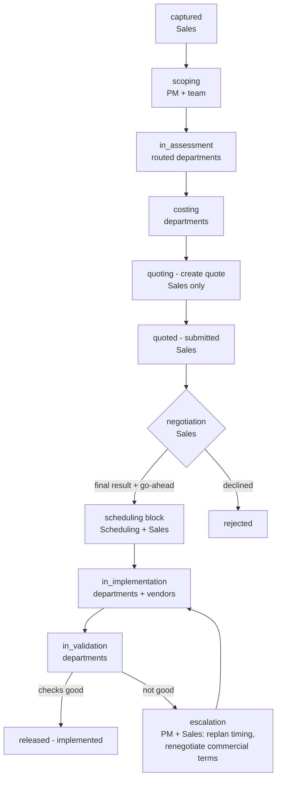

# ECR Process Map — target state and build plan

The governing map for the ECR module (2026-08-12, from process walkthrough
with Christoph). `docs/CHANGE_MANAGEMENT_FLOW.md` holds the mechanics of what
is built; THIS file holds the whole intended flow with responsibilities and
what is still to build. New ECR work should trace back to a stage here.

## The flow

## Stages, responsibilities, artifacts

| # | Stage | Responsible | What happens | Artifacts / gates | Status |
|---|-------|-------------|--------------|-------------------|--------|
| 1 | **captured** | Sales | Request captured with description + attachment; quote-by deadline for customer changes | kickoff gate | BUILT |
| 2 | **scoping** | PM (+ project team) | Impacted set built and Development-locked; scoping meeting decides who assesses. In parallel, any team member may ask for more info (question — Sales answers, asker or PM marks solved) or vote for cancellation; open flags block 'proceed'. No risk register here — risks belong to assessment | impact lock (hard gate), proceed decision, team concerns | BUILT |
| 3 | **in_assessment** | Routed departments (Sales exempt — relies on departments) | Each department: impact checklist, verdict (feasible / with conditions / not feasible + Change PPT), typed risks 1–3, documents (Change PPT / RFQ / customer mails) | risk register; severity-3 risks → offer; not-feasible gate | BUILT (2026-08-11/12 rework) |
| 4 | **costing** | Departments; PM sees all | Cost positions: internal effort (assessment time), implementation support estimate, external positions — estimate or vendor quotes (upload, cost, lead time, shipping separate/included, favorite vote). **Tooling Engineer also quotes part WEIGHT (a guess — validated later).** P&L starts here. Nothing-impacted departments owe nothing | tagged positions; vendor quote docs | IN BUILD (positions/vendors); **weight quote TO BUILD** |
| 5 | **quoting — create quote** | **Sales only** | Sales sees all costs wrapped per department, builds the quote. **The binding vendor choice is Sales' — made here** (departments only voted a favorite at costing). Timeline-builder tool (MS-Project-like, parallel/serial) is FUTURE — placeholder for now | per-department wrap-up; vendor choice; quoted price | IN BUILD (**vendor choice TO BUILD**) |
| 6 | **quoted + negotiation** | Sales | Quote submitted to customer; negotiation tracked to a **final result**; Sales decides go-ahead | negotiation record; final price; go-ahead decision (acceptance carries release deadline — built) | PARTIAL (acceptance built; **negotiation loop TO BUILD**) |
| 7 | **scheduling block** | Scheduling (+ Sales publishes) | Real bank-build plan (bank-build planning partially exists). Decision: **running change vs planned scrap** — customer pays scrap → additional cost quote if they scrap. Sales publishes the plan to the customer. Samplings planned on this timeline; blocked machines are part of it. **The scheduling timeline leads everything downstream** | bank-build plan; scrap decision + scrap quote; published plan | TO BUILD (bank-build basis exists) |
| 8 | **in_implementation** | Implementing departments + vendors | Simple time tracking per department. **Progress report at least 2×/week** with an at-risk flag. Flagged → **Sales escalates** to customer or internally. Samplings happen per the scheduling timeline | progress reports; risk flags; escalations | TO BUILD (skeleton exists) |
| 9 | **in_validation** | Each department (its own checks) | Tool sampled, measured, **cycle time taken**; **weight validated against the costing guess → Sales updates quote (additional cost)**; **revision levels increased per customer statement and validated as correctly implemented**; **second P&L**: real time spent + extra costs | check completion per department; weight delta; revision bump; actuals P&L | TO BUILD (check workflows exist as basis) |
| 10 | **released — implemented** | PM | Validation good → implemented/released. Not good → escalation: PM + Sales replan the timing and renegotiate the commercial terms, loop back | release | BUILT (transition) |

## Cross-cutting rules

- **Scoped views everywhere**: a department sees its own input only — at
  assessment AND costing. PM and Sales see all blocks.
- **Tasks are mandatory** — no accept/claim step; submitting names the owner.
- **Sales owns the customer**: mails tracked on the change (everyone uploads);
  escalations to the customer go through Sales.
- **P&L twice**: planned at costing/quoting, actuals at validation — the
  delta is the learning.
- **The scheduling timeline is the leader** from stage 7 on: samplings,
  blocked machines, department work and escalation all hang off it.

## Build order (next steps, in sequence)

1. **Finish in flight**: costing positions + vendor quotes; `quoting` stage.
2. **Weight quote at costing** — Tooling Engineer states part weight
   (flagged as estimate), carried to validation.
3. **Negotiation loop at `quoted`** — negotiation entries (date, channel,
   result), final result, Sales go-ahead (feeds existing acceptance).
4. **Scheduling block** — bank-build plan on the change, running-change vs
   planned-scrap decision with scrap cost quote, "published to customer"
   stamp by Sales.
5. **Implementation tracking** — per-department time booking, twice-weekly
   progress reports with at-risk flag, Sales escalation records
   (customer/internal).
6. **Validation checks** — per-department checklist (sampled/measured/cycle
   time), weight validation with quote delta to Sales, revision-level bump
   validation, actuals P&L.
7. **Sales' vendor decision at quoting** — the department's favorite is a
   RECOMMENDATION, not binding, but always visible. Sales decides; choosing
   against the engineer's recommendation requires a recorded reason and the
   divergence stays visible (wish and decision side by side). Accountability
   is enforced: whoever decides owns the decision.
8. **Future tool**: Sales timeline builder (MS-Project-like) — placeholder
   until then.

Deliberately deferred (do not lose): the ORDERING/structuring of the cost
position buckets ("we order them later") — tag list stays flat until the team
defines the order.
