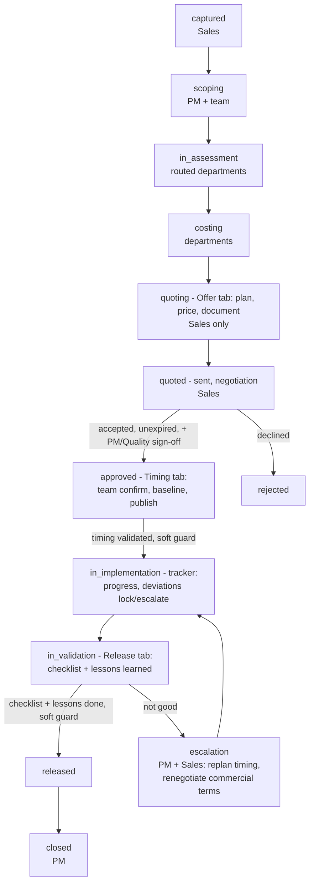

# ECR Process Map — target state and build plan

The governing map for the ECR module (2026-08-12, from process walkthrough
with Christoph). `docs/CHANGE_MANAGEMENT_FLOW.md` holds the mechanics of what
is built; THIS file holds the whole intended flow with responsibilities and
what is still to build. New ECR work should trace back to a stage here.

## The flow

```mermaid
flowchart TD
    A[captured\nSales] --> B[scoping\nPM + team]
    B --> C[in_assessment\nrouted departments]
    C --> D[costing\ndepartments]
    D --> E[quoting - Offer tab: plan, price, document\nSales only]
    E --> F[quoted - sent, negotiation\nSales]
    F -->|accepted, unexpired, + PM/Quality sign-off| H[approved - Timing tab:\nteam confirm, baseline, publish]
    F -->|declined| X[rejected]
    H -->|timing validated, soft guard| I[in_implementation - tracker:\nprogress, deviations lock/escalate]
    I --> J[in_validation - Release tab:\nchecklist + lessons learned]
    J -->|checklist + lessons done, soft guard| K[released]
    K --> M[closed\nPM]
    J -->|not good| L[escalation\nPM + Sales: replan timing,
renegotiate commercial terms]
    L --> I
```

## Stages, responsibilities, artifacts

| # | Stage | Responsible | What happens | Artifacts / gates | Status |
|---|-------|-------------|--------------|-------------------|--------|
| 1 | **captured** | Sales | Request captured with description + attachment; quote-by deadline for customer changes | kickoff gate | BUILT |
| 2 | **scoping** | PM (+ project team) | Impacted set built and Development-locked; scoping meeting decides who assesses. In parallel, any team member may ask for more info (question — Sales answers, asker or PM marks solved) or vote for cancellation; open flags block 'proceed'. No risk register here — risks belong to assessment | impact lock (hard gate), proceed decision, team concerns | BUILT |
| 3 | **in_assessment** | Routed departments (Sales exempt — relies on departments) | Each department: impact checklist, verdict (feasible / with conditions / not feasible + Change PPT), typed risks 1–3, documents (Change PPT / RFQ / customer mails) | risk register; severity-3 risks → offer; not-feasible gate | BUILT (2026-08-11/12 rework) |
| 4 | **costing** | Departments; PM sees all | Cost positions: internal effort (assessment time), implementation support estimate, external positions — estimate or vendor quotes (upload, cost, lead time, shipping separate/included, favorite vote). **Tooling Engineer also quotes part WEIGHT (a guess — validated later).** P&L starts here. Nothing-impacted departments owe nothing | tagged positions; vendor quote docs | IN BUILD (positions/vendors); **weight quote TO BUILD** |
| 5 | **quoting** | **Sales only**, Offer tab (labelled "Approval" for internal changes) | Sales builds the offer from the costing wrap-up: 1) quote plan (rough Gantt seeded from costing, `GanttPlanner.tsx`), 2) price (cost basis, optional factors, risk weighting, changeover: running change vs customer-pays-scrap, piece-price effect), 3) document (CBD or rough description, free fields, terms, preview, PDF). Sending offer v1 auto-transitions to `quoted` | quote plan; `change_offers` draft/versions; offer PDF | BUILT (2026-09-25): `change_plan_service.py`, `offer_service.py`, `offer_pdf.py`, `OfferTab.tsx` |
| 6 | **quoted** | Sales, Offer tab | Negotiation: rounds logged against an offer version; new offer versions record "what changed" (diff); each sent version is valid 30 days from customer receipt. Customer accepts a sent, unexpired version (or an override reason) + PM + Quality sign-off → `approved` | offer versions with diff; negotiation rounds; acceptance (release deadline born here, built) | BUILT (2026-09-25): `offer_service.py::send/patch/apply_customer_response`, `OfferTab.tsx`, `CustomerDecision.tsx` |
| 7 | **approved** (Timing) | PM + Scheduling + all teams | Detailed plan seeded from the quote plan; every responsible team confirms or raises a concern per plan revision; bank build / scrap plan (existing); "Timing validated" sets the baseline on every detailed task and Sales publishes the plan to the customer; MS Project (MSPDI) and CSV export. Timing-validated is a soft guard on `approved -> in_implementation` | detailed plan + baseline; team feedback; validated timing; published plan; MSPDI/CSV export | BUILT (2026-09-25): `change_plan_service.py::validate_timing/post_feedback/mspdi_xml/csv_export`, `TimingTab.tsx`, `TeamFeedbackPanel.tsx` |
| 8 | **in_implementation** | Implementing departments + vendors | Tracker: progress %, actual start/finish per block, twice-weekly reports, time booking (existing). Dates change only by PM/Sales/lead/admin, and only as a **deviation** (reason required); a deviation is locked (accepted internally) or escalated to the customer (creates the stage-8 escalation) | tracker; `change_plan_deviations`; lock/escalate decisions | BUILT (2026-09-25): `change_plan_service.py::bulk_update/lock_deviation/escalate_deviation`, `DeviationsPanel.tsx` |
| 9 | **in_validation** (Release) | Each department (its own checks), PM | Validation checks (existing) plus the **release checklist** (13 items, department-owned, `na` needs a note) and the **lessons learned** step (>=1 lesson or a stated reason for none). Checklist complete + lessons done is a soft guard on `in_validation -> released` | release checklist rows; lessons learned; guard reasons | BUILT (2026-09-25): `release_checklist.py`, `release_service.py`, `ReleaseChecklist.tsx`, `LessonsStep.tsx` |
| 10 | **released → closed** | PM | Summary (plan vs actual, P&L). Validation good → released, PM closes → `closed`. Not good → escalation: PM + Sales replan the timing and renegotiate the commercial terms, loop back to `in_implementation` | release; closed | BUILT (transition); summary view still plain |

## Cross-cutting rules

- **Scoped views everywhere**: a department sees its own input only — at
  assessment AND costing. PM and Sales see all blocks.
- **Tasks are mandatory** — no accept/claim step; submitting names the owner.
- **Sales owns the customer**: mails tracked on the change (everyone uploads);
  escalations to the customer go through Sales.
- **P&L twice**: planned at costing/quoting, actuals at validation — the
  delta is the learning.
- **The scheduling timeline is the leader** from stage 7 on: samplings,
  blocked machines, department work and escalation all hang off it.

## Build order (next steps, in sequence)

1. ~~Finish in flight: costing positions + vendor quotes; `quoting` stage.~~
   Done.
2. **Weight quote at costing**, Tooling Engineer states part weight
   (flagged as estimate), carried to validation. Still open: the costing
   table has the standing third row for Tool Engineer, but the
   validation-time comparison against the costed guess (stage 9, item 6
   below) is not wired up.
3. ~~Negotiation loop at `quoted`, negotiation entries (date, channel,
   result), final result, Sales go-ahead (feeds existing acceptance).~~ Done
   (2026-09-25): `change_negotiations.offer_id` ties a round to an offer
   version; acceptance requires a sent, unexpired offer.
4. ~~Scheduling / timing block, plan on the change, running-change vs
   planned-scrap decision with scrap cost quote, "published to customer"
   stamp by Sales.~~ Done (2026-09-25) as the detailed plan + "Timing
   validated" + publish at `approved`, replacing the earlier bank-build-only
   placeholder. Bank-build mode/scrap-quote decision (`set_bank_build`)
   predates this spec and still sits alongside it.
5. ~~Implementation tracking, per-department time booking, twice-weekly
   progress reports with at-risk flag, deviation records.~~ Done
   (2026-09-25): tracker (progress/actuals), `change_plan_deviations` with
   lock/escalate. Twice-weekly progress reports and time booking predate
   this spec; the at-risk flag is the open deviation, not a separate flag.
6. ~~Validation checks / release, release checklist (13 items) + lessons
   learned step gating `released`.~~ Done (2026-09-25):
   `release_checklist.py`, `release_service.py`. Still open: **weight
   validation against the costing guess feeding a quote delta back to
   Sales**, and **revision-level bump validation per customer statement**
   are not part of the checklist and have no dedicated flow yet. Actuals P&L
   (stage 10 summary, plan vs actual) is also still a plain view, not a
   computed second P&L.
7. ~~Sales' vendor decision at quoting~~ Done (predates this spec):
   department favorite is a recommendation, Sales' choice is binding and
   recorded (`vendor_chosen` changelog, `costing_position_service.py`).
8. **Future tool**: a richer Sales timeline builder beyond `GanttPlanner.tsx`
   (e.g. resource levelling) is still just the current Gantt; no further
   placeholder work planned unless requested.
9. **Open from the 2026-09-25 spec itself**: the actuals-vs-plan P&L view at
   `released`/`closed` (stage 10) is not built; the release summary is a
   plain view today.

Deliberately deferred (do not lose): the ORDERING/structuring of the cost
position buckets ("we order them later") — tag list stays flat until the team
defines the order.
