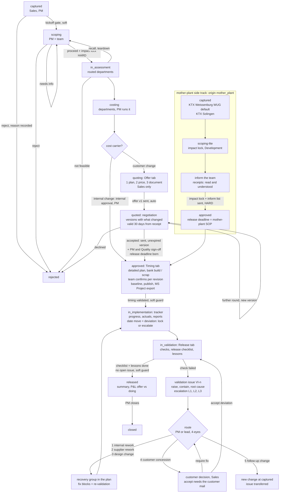
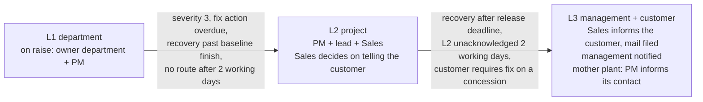

# ECR Process Map: target state and build plan

The governing map for the ECR module (2026-08-12, from process walkthrough
with Christoph). `docs/CHANGE_MANAGEMENT_FLOW.md` holds the mechanics of what
is built; THIS file holds the whole intended flow with responsibilities and
what is still to build. New ECR work should trace back to a stage here.

## The flow

Main path, the internal branch, the validation-issue branch and the
mother-plant side track. The in-app Process Flow page
(`frontend/src/pages/ProcessMapPage.tsx`, `/process-map`) draws the same
flow with gates, loops, artifacts, P&L touchpoints and the deadline rail.

```mermaid
flowchart TD
    A[captured<br/>Sales, PM] -->|kickoff gate, soft| B[scoping<br/>PM + team]
    A -->|reject, reason recorded| X[rejected]
    B -->|needs info| B
    B -->|reject| X
    B -->|proceed + impact lock HARD| C[in_assessment<br/>routed departments]
    C -->|not feasible| X
    C -->|recall, teardown| B
    C --> D[costing<br/>departments, PM runs it]
    D --> CC{cost carrier?}
    CC -->|customer change| E[quoting: Offer tab<br/>1 plan, 2 price, 3 document<br/>Sales only]
    CC -->|internal change: internal approval, PM| H
    E -->|offer v1 sent, auto| F[quoted: negotiation<br/>versions with what changed<br/>valid 30 days from receipt]
    F -->|further round, new version| F
    F -->|declined| X
    F -->|accepted: sent, unexpired version<br/>+ PM and Quality sign-off<br/>release deadline born| H[approved: Timing tab<br/>detailed plan, bank build / scrap<br/>team confirms per revision<br/>baseline, publish, MS Project export]
    H -->|timing validated, soft guard| I[in_implementation: tracker<br/>progress, actuals, reports<br/>date move = deviation: lock or escalate]
    I --> J[in_validation: Release tab<br/>checks, release checklist, lessons]
    J -->|check failed| VI[validation issue VI-n<br/>raise, contain, root cause<br/>escalation L1, L2, L3]
    VI --> R{route<br/>PM or lead, 4-eyes}
    R -->|1 internal rework<br/>2 supplier rework<br/>3 design change| RG[recovery group in the plan<br/>fix blocks + re-validation]
    RG --> I
    R -->|4 customer concession| CD[customer decision, Sales<br/>accept needs the customer mail]
    CD -->|require fix| R
    CD -->|accept deviation| J
    R -->|5 follow-up change| FU[new change at captured<br/>issue transferred]
    J -->|checklist + lessons done<br/>no open issue, soft guard| K[released<br/>summary, P&L offer vs doing]
    K -->|PM closes| M[closed]

    subgraph MPL [mother-plant side track: origin mother_plant]
      MA[captured<br/>KTX Weissenburg WUG default<br/>KTX Solingen] --> MB[scoping-lite<br/>impact lock, Development]
      MB --> MC[inform the team<br/>receipts: read and understood]
      MC -->|impact lock + inform list sent, HARD| MH[approved<br/>release deadline = mother-plant SOP]
    end
    MH --> H
```

Escalation ladder per open validation issue (spec section 12a):

```mermaid
flowchart LR
    L1[L1 department<br/>on raise: owner department + PM] -->|severity 3, fix action overdue,<br/>recovery past baseline finish,<br/>no route after 2 working days| L2[L2 project<br/>PM + lead + Sales<br/>Sales decides on telling the customer]
    L2 -->|recovery after release deadline,<br/>L2 unacknowledged 2 working days,<br/>customer requires fix on a concession| L3[L3 management + customer<br/>Sales informs the customer, mail filed<br/>management notified<br/>mother plant: PM informs its contact]
```

## Stages, responsibilities, artifacts

| # | Stage | Responsible | What happens | Artifacts / gates | Status |
|---|-------|-------------|--------------|-------------------|--------|
| 1 | **captured** | Sales (PM may start) | Request captured with description + attachment; quote-by deadline for customer changes. Origin `customer`, `internal` or `mother_plant` (mother plant: see the side track below) | kickoff gate | BUILT (origin: TO BUILD) |
| 2 | **scoping** | PM (+ project team) | Impacted set built and Development-locked; scoping meeting decides who assesses. In parallel, any team member may ask for more info (question: Sales answers, asker or PM marks solved) or vote for cancellation; open flags block 'proceed'. No risk register here: risks belong to assessment | impact lock (hard gate), proceed decision, team concerns | BUILT |
| 3 | **in_assessment** | Routed departments (Sales exempt, relies on departments) | Each department: impact checklist, verdict (feasible / with conditions / not feasible + Change PPT), typed risks 1 to 3, documents (Change PPT / RFQ / customer mails) | risk register; severity-3 risks → offer risk weights; not-feasible gate | BUILT |
| 4 | **costing** | Departments; PM runs it and sees all | Cost lines with a lead time on every line, internal hours, estimates or vendor quotes (upload, cost, lead time, shipping, favorite vote). Tool Engineer also states the part weight (an estimate, validated later). **P&L planned starts here.** Nothing-impacted departments owe nothing. Closing costing forks on the cost carrier: customer change → `quoting`, internal change → internal approval → `approved` | cost lines; vendor quote docs; weight estimate | BUILT; weight comparison at validation TO BUILD |
| 5 | **quoting** | **Sales only**, Offer tab ("Approval" for internal changes) | 1 plan: quote plan (rough Gantt seeded from costing), 2 price: cost basis, optional factors, risk weights, changeover (running change vs customer pays scrap), piece-price effect, 3 document: CBD or rough description, free fields, terms, preview, PDF. Sending offer v1 moves to `quoted` on its own | quote plan; `change_offers` draft; offer PDF | BUILT (2026-09-25): `change_plan_service.py`, `offer_service.py`, `offer_pdf.py`, `OfferTab.tsx` |
| 6 | **quoted** | Sales, Offer tab | Negotiation rounds logged against an offer version; new versions record "what changed" (diff); each sent version is valid 30 days from customer receipt. Customer accepts a sent, unexpired version (expired: override reason) + PM + Quality sign-off → `approved`; declined → `rejected`. **P&L planned is frozen at acceptance** (`_snapshot.pnl`) | offer versions with diff; negotiation rounds; acceptance (release deadline born) | BUILT (2026-09-25): `offer_service.py`, `OfferTab.tsx`, `CustomerDecision.tsx` |
| 7 | **approved** (Timing) | PM + Scheduling + all teams | Detailed plan seeded from the quote plan; bank build / scrap plan; every responsible team confirms or raises a concern per plan revision (edits make confirmations stale); "Timing validated" sets the baseline on every block (no errors, no idea blocks); Sales publishes the plan to the customer; MS Project (MSPDI) and CSV export. Soft guard on `approved -> in_implementation` | detailed plan + baseline; team feedback; published plan; MSPDI/CSV | BUILT (2026-09-25): `change_plan_service.py`, `TimingTab.tsx`, `TeamFeedbackPanel.tsx` |
| 8 | **in_implementation** | Implementing departments + vendors | Tracker: progress %, actual start/finish per block, twice-weekly reports, time booking. After the baseline dates change only by PM/Sales/lead/admin, each move a **deviation** with a reason: locked (accepted internally) or escalated to the customer through Sales. Open deviations inform, never gate. A validation issue on a fix route returns here with a **recovery group** in the plan. **P&L actual** from here: booked hours x rate, actual cost entries | tracker; `change_plan_deviations`; recovery groups | BUILT (2026-09-25); recovery group IN BUILD; actual costs IN BUILD |
| 9 | **in_validation** (Release) | Each department (its own checks), PM | Validation checks, the **release checklist** (13 items, department-owned, `na` needs a note), the **lessons learned** step. A failed check raises a **validation issue** (section below). Release waits for checklist + lessons + no open issue (soft guard). **P&L actual** adds issue costs by bearer | release checklist; lessons learned; validation issues; guard reasons | BUILT (checklist, lessons); validation issues IN BUILD; weight delta + revision bump TO BUILD |
| 10 | **released → closed** | PM | Summary: plan vs actual timing and the **P&L offer vs doing** (planned vs actual margin, variance, slip). PM closes → `closed` | release; summary; closed | BUILT (transition); offer-vs-actual summary IN BUILD |

Off-path: `on_hold` (reversible parking state), `rejected` (reversible with
a memo), `cancelled` (terminal).

### Validation issues (spec section 12, 12a)

A failed check becomes an issue `VI-n` with a light 8D shape: raise (any
routed department member, PM, lead) → containment (required before the
route at severity 3) → root cause (required before any route, except a
concession the customer accepts as-is) → **route**, decided by PM or lead
with a reason (4-eyes: not the raiser):

| Route | Where it goes |
|---|---|
| 1 `internal_rework` | back to `in_implementation`, fix actions, recovery group in the plan |
| 2 `supplier_rework` | same, supplier named, chargeback optional |
| 3 `design_change` | same, customer informed by default |
| 4 `customer_concession` | Sales records the customer decision; `accept_deviation` closes the issue as `accepted` only with a customer mail filed (hard); `require_fix` reopens the route |
| 5 `follow_up_change` | new change at `captured` (same project), issue `transferred`; this change may release |

Fix actions done → re-validation (the linked check answered `passed` again)
→ issue `closed`. When the recovery pushes the plan past the release
deadline, Sales records the customer's `new_timing` (release deadline moved,
audited) or `require_fix` (PM shortens the recovery). Every issue carries an
escalation level (ladder above). Release is refused while any issue is open.

### Mother-plant side track (spec section 14)

Changes engineered and commercially handled by the mother plant (dropdown:
**KTX Weissenburg (WUG)** default, **KTX Solingen**): `captured → scoping →
approved → in_implementation → in_validation → released → closed`. No
assessment, costing, offer or quote deadline. At scoping the PM sends the
information to the chosen departments (one receipt each, "Read and
understood" task; open receipts show in Blocked by as information);
`scoping → approved` is hard-gated on the impact lock and the inform list
being sent. On `approved` the release deadline is the mother-plant SOP; the
plan is seeded from their MS Project file, else an SOP milestone. Timing as
usual with an "Inform mother plant" stamp instead of the customer publish;
escalation L3 informs the mother-plant contact via the PM. P&L: actual local
costs only. Status: TO BUILD.

## Cross-cutting rules

- **Scoped views everywhere**: a department sees its own input only, at
  assessment AND costing. PM and Sales see all blocks.
- **Tasks are mandatory**: no accept/claim step; submitting names the owner.
- **Sales owns the customer**: mails tracked on the change and filed into
  each validation issue (everyone uploads); escalations to the customer go
  through Sales.
- **Two deadlines, one active**: quote-by until `quoted` (freezes the on-time
  fact); release-due born at acceptance, internal approval or from the
  mother-plant SOP, moved only with an audited reason (customer
  `new_timing` on a validation issue).
- **P&L offer vs doing**: planned starts at costing and is frozen at
  acceptance; actuals from implementation on (booked hours x rate, actual
  cost entries, validation-issue costs by bearer); compared at release. The
  delta is the learning.
- **The detailed plan is the leader** from stage 7 on: samplings, bank
  build, department work, recovery groups and escalation all hang off it;
  after the baseline every date move is a deviation with a reason.
- **No release with an open validation issue**; each issue carries an
  escalation level (L1 department, L2 project, L3 management + customer).

## Build order (next steps, in sequence)

1. ~~Finish in flight: costing positions + vendor quotes; `quoting` stage.~~
   Done.
2. **Weight quote at costing**, Tooling Engineer states part weight
   (flagged as estimate), carried to validation. Still open: the costing
   table has the standing third row for Tool Engineer, but the
   validation-time comparison against the costed guess (stage 9, item 6
   below) is not wired up.
3. ~~Negotiation loop at `quoted`, negotiation entries (date, channel,
   result), final result, Sales go-ahead (feeds existing acceptance).~~ Done
   (2026-09-25): `change_negotiations.offer_id` ties a round to an offer
   version; acceptance requires a sent, unexpired offer.
4. ~~Scheduling / timing block, plan on the change, running-change vs
   planned-scrap decision with scrap cost quote, "published to customer"
   stamp by Sales.~~ Done (2026-09-25) as the detailed plan + "Timing
   validated" + publish at `approved`, replacing the earlier bank-build-only
   placeholder. Bank-build mode/scrap-quote decision (`set_bank_build`)
   predates this spec and still sits alongside it.
5. ~~Implementation tracking, per-department time booking, twice-weekly
   progress reports with at-risk flag, deviation records.~~ Done
   (2026-09-25): tracker (progress/actuals), `change_plan_deviations` with
   lock/escalate. Twice-weekly progress reports and time booking predate
   this spec; the at-risk flag is the open deviation, not a separate flag.
6. ~~Validation checks / release, release checklist (13 items) + lessons
   learned step gating `released`.~~ Done (2026-09-25):
   `release_checklist.py`, `release_service.py`. Still open: **weight
   validation against the costing guess feeding a quote delta back to
   Sales**, and **revision-level bump validation per customer statement**
   are not part of the checklist and have no dedicated flow yet. Actuals P&L
   (stage 10 summary, plan vs actual) is also still a plain view, not a
   computed second P&L.
7. ~~Sales' vendor decision at quoting~~ Done (predates this spec):
   department favorite is a recommendation, Sales' choice is binding and
   recorded (`vendor_chosen` changelog, `costing_position_service.py`).
8. **Future tool**: a richer Sales timeline builder beyond `GanttPlanner.tsx`
   (e.g. resource levelling) is still just the current Gantt; no further
   placeholder work planned unless requested.
9. **P&L offer vs doing** (spec section 13): `change_actual_costs`, the
   offer-vs-actual table on the change and the P&L page columns. IN BUILD.
10. **Validation issues** (spec sections 12, 12a): raise from a failed check,
   containment, root cause, the five routes, customer decision, recovery
   group in the Gantt, escalation ladder L1 to L3. IN BUILD.
11. **Mother-plant side track** (spec section 14): origin, inform receipts,
   `scoping -> approved` for origin `mother_plant`, SOP as release deadline,
   Mother plant tab. TO BUILD.

Deliberately deferred (do not lose): the ORDERING/structuring of the cost
position buckets ("we order them later"): the tag list stays flat until the team
defines the order.
