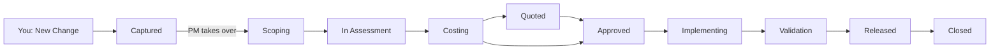
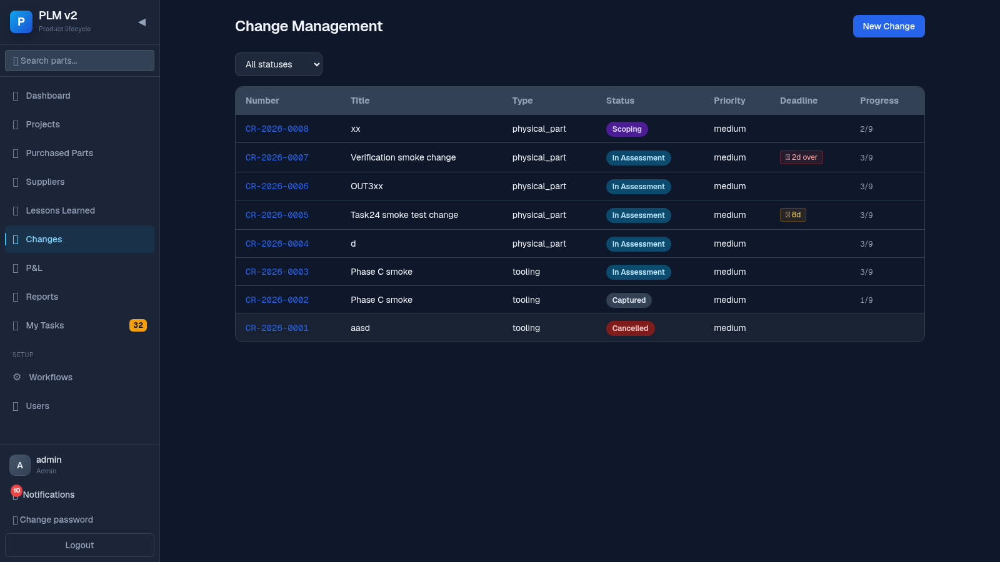
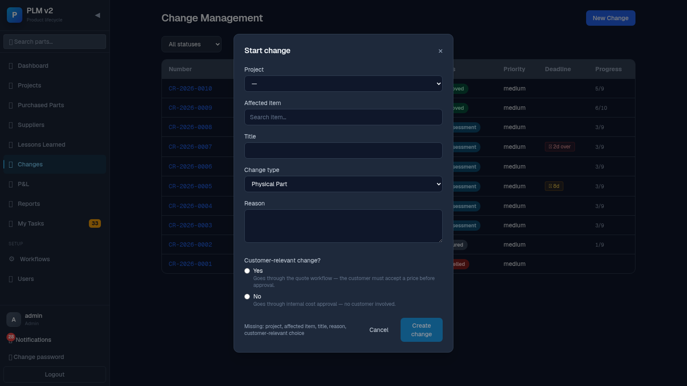
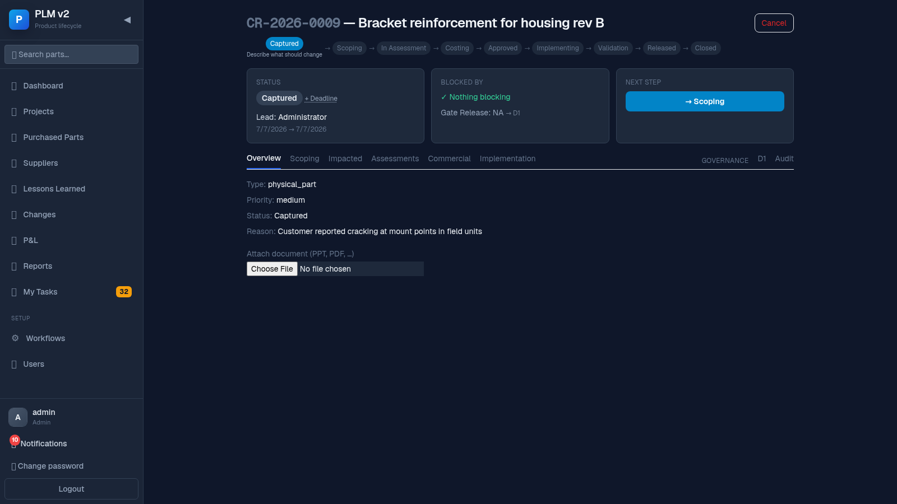

# Raising a Change (Initiator Guide)

Anyone can raise a change — you don't need a special role. This guide covers capturing a new
change and tracking it afterwards.

## Your slice of the flow

## Your job in one paragraph

You notice something that needs to change — a part, a tool, a document, a process, or packaging —
and you describe it clearly enough that Project Management can scope it: what should change, on
which item, and why. After that, the change belongs to Project Management and the relevant
departments; you can track its progress any time from the Changes list, and add attachments as
supporting material.

## Steps

### 1. Open the New Change form

Go to **Changes** in the sidebar and click **New Change**.

### 2. Fill in the capture form

What you see / what you do:

- **Project** — pick the project this change belongs to.
- **Affected item** — search and pick the part or tool being changed (Articles and Tools &
  equipment are listed separately).
- **Title** — a short, clear summary.
- **Reason** — why the change is needed.
- **Change type** — Physical Part, Tooling, Document / Spec, Process / IM, or Packaging. It's
  guessed from the item you picked, but you can override it.
- **Customer-relevant change?** — Yes or No. Each option shows a one-line explanation right
  under it:
  - **Yes**: "Goes through the quote workflow — the customer must accept a price before approval."
  - **No**: "Goes through internal cost approval — no customer involved."

If anything required is still missing, the **Create change** button stays disabled and a line
under it lists exactly what's missing (e.g. "Missing: project, customer-relevant choice").

### 3. Submit

Click **Create change**. You land straight on the new change's cockpit, already in **Captured**
status.

### 4. Track it afterwards

- From the **Changes** list, each row shows a **status pill**, a **deadline chip**, and a
  **progress chip** like `1/9` (step 1 of however many steps this change's branch has) — so you
  can see how far along it is without opening it.
- Open the change to see the full **stepper** across the top of the cockpit — it highlights the
  current step and shows only the steps this change will actually go through (no Quoted step for
  internal changes).

### 5. Attachments

On the **Overview** tab you can attach supporting documents (PPT, PDF, etc.) at any time — use the
file picker under "Attach document". Attached files are listed right below it.

## When things block

- **The Create button won't turn on** — read the "Missing: ..." line under it; it names every
  required field you haven't filled in yet.
- **I don't see my change move forward** — after Captured, it's Project Management's job to run
  the scoping meeting and decide Proceed / Reject / Needs more info. If nothing has happened for a
  while, check the deadline chip on the Changes list, or ask your PM.
- **I picked the wrong customer-relevant answer** — ask an admin or the change lead; it can be
  edited from the Overview tab (visible as an editable line there) until scoping ends.
