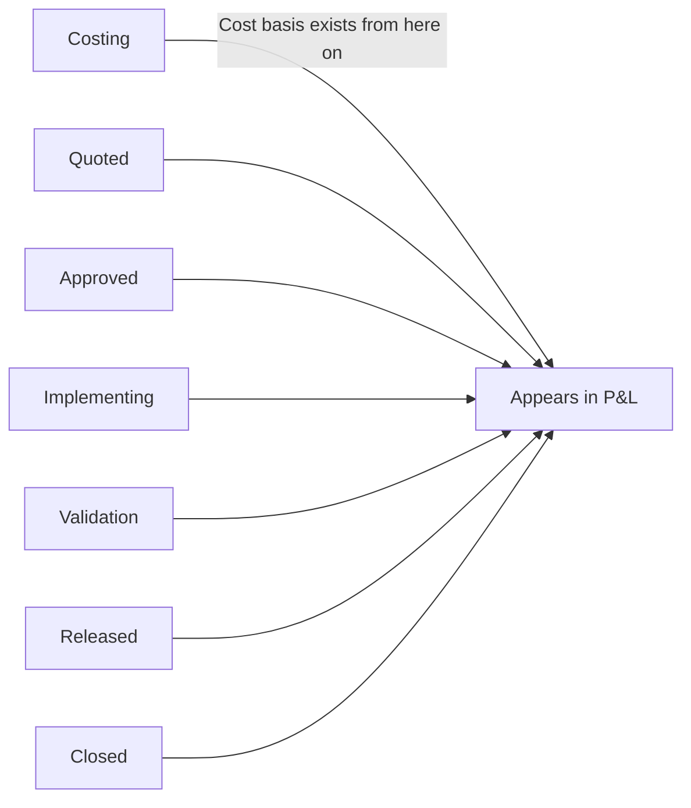
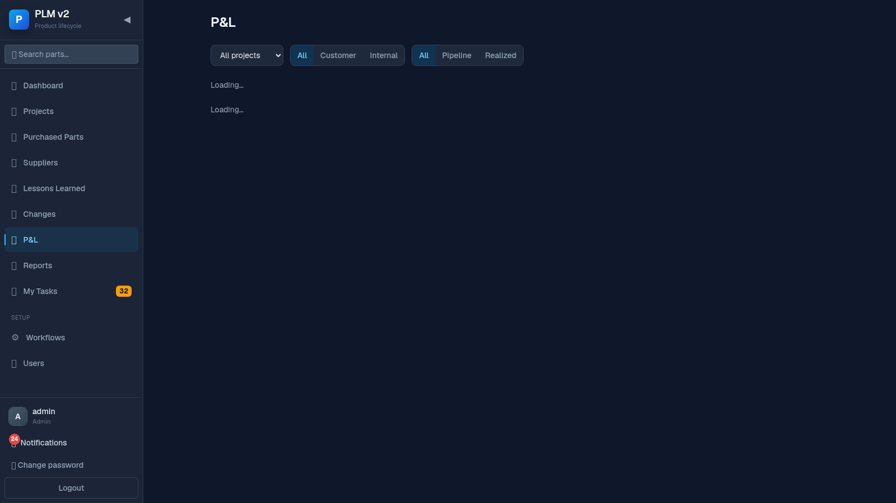

# Management Guide — Reading the P&L Page

This guide is for anyone who wants a financial overview of the change portfolio, not the
day-to-day mechanics of running a single change.

## Your slice of the flow

A change only shows up in P&L once it reaches **Costing** — before that there's no cost data to
report on.

## Your job in one paragraph

The **P&L** page gives you revenue, cost, and margin across every change that has reached costing
or beyond, split by project, branch (customer vs. internal), and pipeline vs. realized. It's a
read-only reporting view — you don't act on it here, but it's the fastest way to see where money
is being made, spent, or budgeted, and you can drill into any single change from it.

## Steps

### 1. Open the P&L page

Click **P&L 💰** in the sidebar (right after Changes).

### 2. Read the summary tiles

- **Revenue** — total quoted price across customer-relevant changes in view.
- **Cost** — total cost, with internal/external split shown underneath.
- **Margin** and **Margin %** — revenue minus cost, colored emerald (positive) or red (negative).

### 3. Pipeline vs. Realized

Two side-by-side cards break the same totals into:

- **Pipeline** — changes not yet approved.
- **Realized** — changes that are approved or further along.

This tells you how much value is still "in flight" vs. already locked in.

### 4. Filter

Use the filter bar to narrow by **project**, **branch** (Customer / Internal), and **status
group** (Pipeline / Realized).

### 5. The per-change table

Each row shows: change number (a link), title, branch, status, revenue, internal cost, external
cost, and margin. A few things to know when reading it:

- **Branch: Internal** rows show a "vs. approved budget" margin — this is *not* profit. Internal
  changes have no customer paying for them; their "revenue" line is the internally approved
  budget, and the margin is how actual cost compares to that budget. A tooltip on the row and the
  Margin column header both call this out explicitly.
- **Branch: Customer** rows show real margin: quoted price minus total cost.
- If a customer-relevant change hasn't been quoted yet, its revenue cell shows a "price pending"
  badge instead of a number — the cost basis exists (it's in costing) but there's no price yet.

### 6. Drill into a change

Click any change number to jump straight to that change's cockpit, opened on the **Commercial**
tab — the same tab where the quote, sign-offs, and internal cost approval live, plus a compact
version of the same P&L card scoped to that one change.

## When things block

- **A change I expect to see isn't listed** — it hasn't reached Costing yet (still in Captured,
  Scoping, or In Assessment). There's no cost basis before that, so it's deliberately excluded.
- **A row's revenue shows "price pending"** — Sales hasn't entered a quoted price yet for this
  customer-relevant change; cost and effort figures may already be populated even though revenue
  isn't.
- **I don't understand why an internal change's margin is negative** — that means actual cost has
  exceeded the amount Project Management approved. This is expected to be visible and readable —
  the label says "vs. approved budget" specifically so it doesn't get mistaken for profit/loss on
  a sale.
