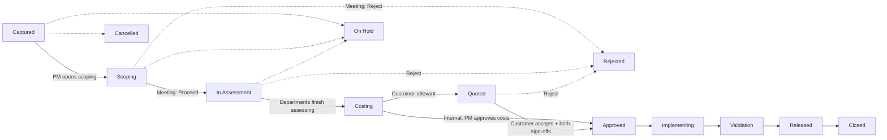

# Change Management — User Manual

This is the plain-language guide to the Change Management system in PLM v2. It covers the whole
lifecycle of a change, from the first idea to closing it out, and explains what everyone sees in
the app along the way.

If you only work in one department, you may prefer the shorter guide for your role:

- [`initiator.md`](initiator.md) — anyone raising a change
- [`project-management.md`](project-management.md) — Project Management (scoping, costing, approvals)
- [`technical-departments.md`](technical-departments.md) — R&D, Tool Engineering and other assessors
- [`sales.md`](sales.md) — Sales / commercial
- [`quality.md`](quality.md) — Quality (sign-off, D1 gates, Audit)
- [`management-pnl.md`](management-pnl.md) — Management (P&L)

## What is a "change"?

A change is any request to alter something already agreed — a part, a tool, a document, a
process, or packaging. Someone notices a problem or an improvement, writes it up, and the system
walks it through everyone who needs to look at it before it's actually done.

## The one thing to remember: two branches

Every change follows the same shape, but splits into one of two branches depending on whether a
customer is affected:

- **Customer-relevant** — the customer has to agree to a price before the change is approved.
- **Internal** — no customer is involved; Project Management approves the internal cost instead.

You choose which branch applies when you first raise the change ("Customer-relevant change?").
This choice decides which steps you'll see later — customer-relevant changes get a **Quoted**
step; internal changes skip straight from Costing to Approved.

## Full lifecycle

`On Hold`, `Rejected` and `Cancelled` are side states — a change can drop into them from several
points, and (for On Hold) can be resumed back into the flow.

## Status glossary

| Status | What it means |
|---|---|
| Captured | Describe what should change |
| Scoping | Meet, decide, pick departments |
| In Assessment | Departments check feasibility & cost |
| Costing | Sum up costs |
| Quoted | Offer sent to customer |
| Approved | Go decision made |
| Implementing | Doing the work |
| Validation | Checking results |
| Released | Change is live |
| Closed | Wrapped up |
| On Hold | Paused; can be resumed |
| Rejected | Stopped at scoping, assessment or quote |
| Cancelled | Stopped permanently, reason recorded |

## Roles at a glance

| Role | What they do in Change Management |
|---|---|
| Anyone (Initiator) | Raises a change with the New Change form |
| Project Management (PM) | Runs the scoping meeting, decides Proceed/Reject/Needs more info, drives the change through its steps, checks the cost summation, approves internal costs |
| Technical departments (R&D, Tool Engineering, etc.) | Claim their assessment task, give a feasibility verdict, log effort hours and cost lines |
| Sales | Sets the required-by deadline, enters the quoted price, records the customer's response |
| Quality | Signs off (with PM) before a customer-relevant change is approved, and works the D1/Audit governance tabs |
| Admin / Engineer | See the Setup group (Workflows designer, Users) that everyday users don't see |
| Management | Reads the P&L page across all changes |

A quick note on **RASIC** if you see the letters R/A/S/C/I next to a department in the
Assessments tab: it just marks that department's role for that step — **R**esponsible (does the
work), **A**ccountable (owns the outcome), **S**upport, **C**onsulted, **I**nformed.

## Reading the cockpit

Open any change and you land on its cockpit. Three things orient you immediately:

1. **The stepper** at the top shows every step this change will pass through, with the current one
   highlighted and a short plain-language hint underneath (e.g. "Sum up costs" for Costing). It is
   branch-aware: an internal change's stepper simply has no Quoted step, because that change will
   never go through it.
2. **Three cards** right below the stepper:
   - **Status** — the current status pill, the lead, the deadline, and when the change was created/updated.
   - **Blocked by** — lists anything stopping the change moving forward: an open gate, pending
     deviations, overdue assessments, an unconfirmed impact, or unclaimed tasks. If nothing is
     blocking, it says "Nothing blocking".
   - **Next step** — a button for each status the change could move to next. Click it to advance.
3. **Tabs** below that: Overview · Scoping · Impacted · Assessments · Commercial · Implementation.
   These are the tabs everyone sees. If you're an admin, the change lead, or a member of Quality
   or Project Management, you also get a right-aligned **Governance** group with **D1** and
   **Audit** tabs — these hold the formal D1 gate fields and the full audit trail, and stay hidden
   for everyone else.

The changes list (`Changes` in the sidebar) shows every change with a **step chip** (e.g. `4/9`)
so you can scan the whole pipeline without opening each one, plus a deadline chip and the status
pill.

## Notifications and escalations

- The bell icon (bottom of the sidebar) shows a red badge with your unread count. Click it for a
  feed of notifications grouped by change; clicking a notification jumps you straight to the
  relevant tab.
- **My Tasks** (sidebar) is your personal work list: an **Escalations** card at the top ("⚠
  Escalations — overdue in my changes") lists anything overdue in changes you lead, a **Change
  Assessments** table lists assessment tasks you can claim or that are already yours, and further
  down are any workflow/SEP/lesson tasks you have.
- A deadline shows as on-track, at-risk, or overdue (a small clock chip, e.g. "3d" or "2d over").
  Overdue assessments and overdue deadlines both notify the change's lead as well as the task
  owner, so nothing overdue relies on one person noticing.

## P&L overview

The **P&L 💰** page (sidebar, next to Reports) is a portfolio view over every change that has
reached Costing or beyond — there's no meaningful cost figure before that. For each change you see
Revenue (or, for internal changes, the approved budget), Cost (split into internal/external), and
Margin. Customer changes show a real margin (quote minus cost); internal changes show the
approved-budget figure and label the difference **"vs. approved budget"** — it is deliberately
never called "profit", since no customer paid for that work. The page also splits totals into
Pipeline (not yet approved) vs. Realized (approved and beyond), and you can filter by project,
branch (customer/internal) and status group. Clicking a row's change number jumps to that change's
Commercial tab, which also carries a compact version of the same card. See
[`management-pnl.md`](management-pnl.md) for more detail.

## FAQ

**Why can't I approve this change?**
For customer-relevant changes: "Approve requires customer acceptance + both sign-offs" — the
customer must have accepted the quote, and both a PM and a Quality person must have signed off.
For internal changes: PM has to click "Approve internal costs" first; that button only becomes
available once the change reaches Costing.

**Why did my selected department not get an assessment?**
Scoping department selection and actual assessment tasks aren't always the same thing. Tasks are
generated from the routing template's rules for which departments are *blocking* for this kind of
change — a department you picked in the meeting but that has no blocking role in the template
won't get a task. The Assessments tab shows a line explaining exactly which selections mapped to
tasks and which didn't, so you can see it rather than guess.

**Why is the Quoted step missing from the stepper?**
Because the change is internal (not customer-relevant). Internal changes never go through a quote
— they go straight from Costing to Approved once PM approves the internal cost.

**Who can see the Audit tab?**
Only admins, the change's lead, and members of Quality or Project Management. Everyone else sees
the everyday tab set (Overview, Scoping, Impacted, Assessments, Commercial, Implementation) with
no Governance group at all. If you follow a link straight to `?tab=audit` without permission, it
quietly falls back to Overview.

**Why is the Commercial tab just a message with no controls?**
Before a change reaches Costing there's no cost data yet, so there's nothing to quote or approve.
The tab shows an explanation naming the current status instead of a dead disabled button.

**Why can't I click the sign-off button?**
The 4-eyes rule: the PM sign-off and Quality sign-off must be two different people. If you already
signed as one role, the system won't let you sign as the other — the button is disabled and a note
explains why.

**What does "overdue" mean for an assessment?**
The assessment has a due date that has passed and hasn't been submitted yet. It shows up with a
red "⚠ overdue" marker wherever it's listed, and both the task owner and the change lead get
notified.

**What's the "n/m" chip on the Changes list?**
It's the change's position in its own lifecycle — e.g. `4/9` means "4th of 9 steps for this
change's branch". Internal changes have one fewer step (`.../8`) because they skip Quoted.

**What's the difference between "Revenue" and "Approved budget" on P&L?**
Revenue is what a customer is paying (the quoted price) — only customer-relevant changes have it.
Approved budget is what PM signed off internally for a change with no customer; there's no sale,
so the comparison against cost is a budget variance, not profit.

**Can I attach documents to a change?**
Yes — the Overview tab has an attachment uploader (PPT, PDF, etc.) with the list of files already
attached shown below it.
