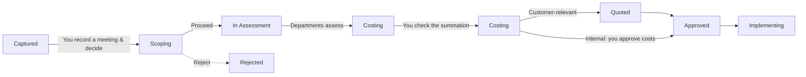
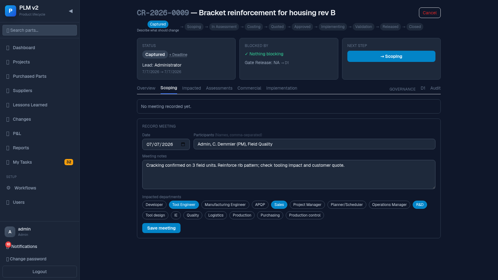
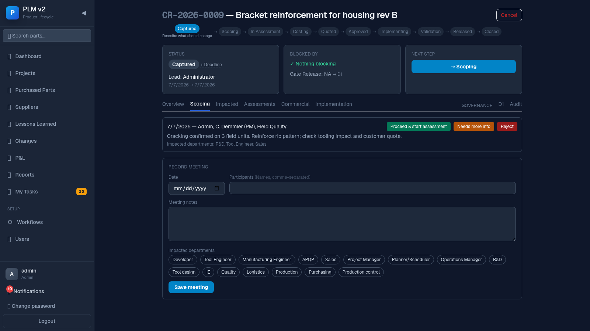
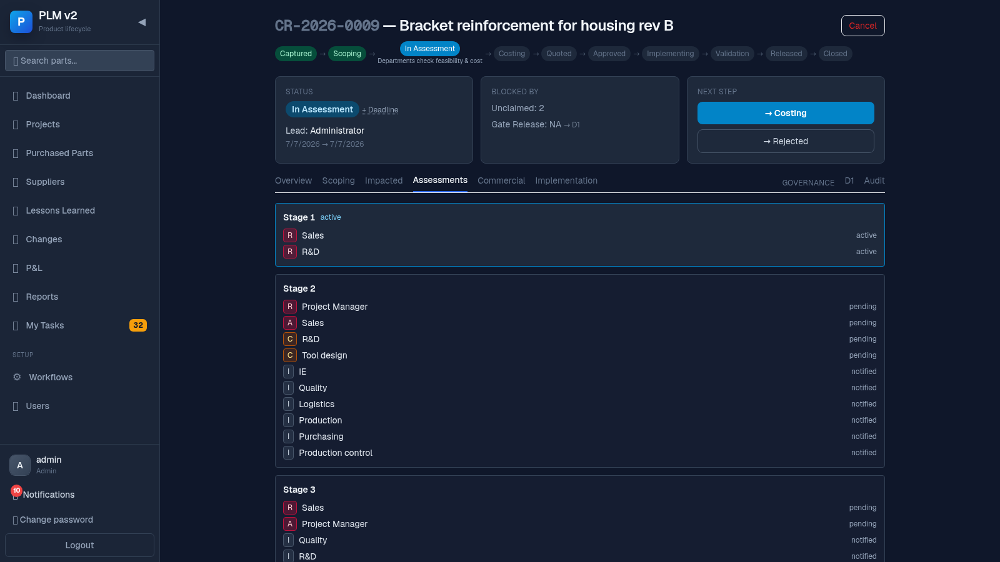
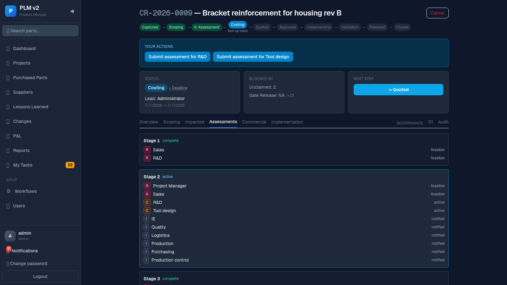
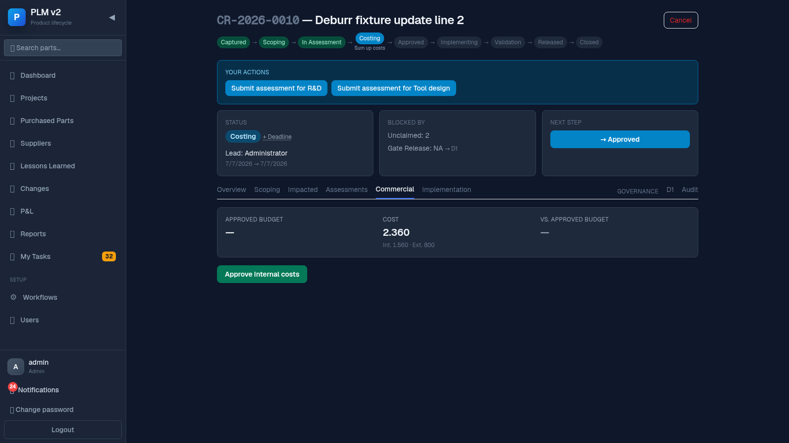
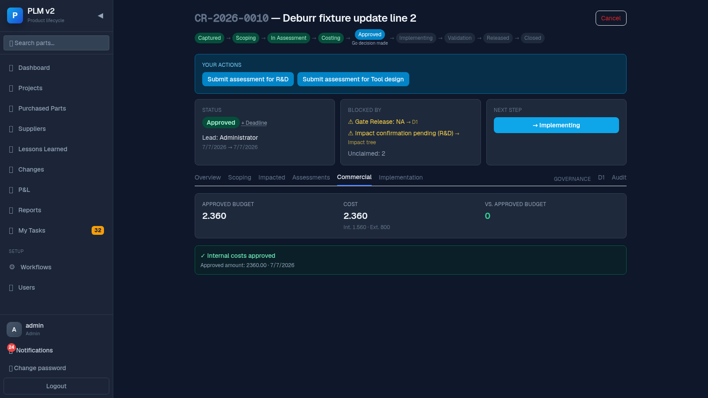

# Project Management Guide

Project Management (PM) owns a change from the moment it's captured to the moment it's approved.
You run the scoping meeting, decide whether the change proceeds, keep an eye on costs, and push it
forward at each step.

## Your slice of the flow

## Your job in one paragraph

Once a change is captured, you run a scoping meeting to decide whether it's worth pursuing and
which departments need to weigh in; if you proceed, the system creates assessment tasks for the
relevant departments. While assessments come in, you watch the cost summation build up; once
costing is done, you either wait for Sales/customer sign-off (customer-relevant changes) or
approve the internal cost yourself (internal changes) and move the change to Approved. Throughout,
you're usually the change's **lead**, so overdue items across your changes come straight to you.

## Steps

### 1. Record the scoping meeting

Open the change and go to the **Scoping** tab.

What you see / what you do:

- A list of any meetings already recorded for this change.
- A **Record meeting** form: **Date**, **Participants** (names, comma-separated), **Meeting
  notes**, and **Impacted departments** (toggle each department that needs to look at this
  change).
- Click **Save meeting**.

### 2. Decide

Once a meeting exists and no decision has been made yet, three buttons appear next to it:

- **Proceed & start assessment** — moves the change into assessment; assessment tasks are created.
- **Needs more info** — the meeting is recorded but the change doesn't move on yet.
- **Reject** — stops the change here.

### 3. Understand which departments actually got a task

After you proceed, open the **Assessments** tab. A line at the top reads something like
"From scoping: R&D ✓, Sales ✓ · Tool Engineering has no blocking role in the routing template —
no assessment task" — this tells you which of your selected departments actually received a task
and which didn't, and why, so nobody has to guess where a department's task went.

### 4. Set the deadline and lead

In the cockpit's **Status** card you can edit the deadline (✎ next to the deadline chip, or "+
Deadline" if none is set) and see who the current lead is. The lead is usually set when the change
is captured but can be adjusted by an admin or the current lead.

### 5. Drive it forward with "Next step"

The **Next step** card in the cockpit always shows the button(s) for wherever this change can go
next — click it to advance. If a transition is blocked, the reason appears in the **Blocked by**
card (open gate, pending deviation, overdue assessment, unclaimed task, or unconfirmed impact) — it
always names the reason and, where possible, a jump-in button to resolve it.

### 6. Check the cost summation before moving out of Costing

Once assessments are submitted with cost lines, the D1 tab's summation view shows a rollup: total
one-time/lifecycle internal and external cost, broken down by department and by plant, plus total
effort hours. Use this to sanity-check the numbers before approving.

### 7. Internal branch: approve the cost

For changes that are **not** customer-relevant, open the **Commercial** tab once the change is in
Costing. Click **Approve internal costs** — this snapshots the currently summed amount and a
timestamp. After that you can advance the change to **Approved** directly; there is no Quoted step
for internal changes.

### 8. Escalations you receive as lead

As the change's lead, you get notified (bell + **My Tasks → Escalations**) whenever anything in
one of your changes is overdue — an unclaimed or overdue assessment, or an at-risk/overdue
deadline — even if you are not the task owner yourself.

## When things block

- **"Approve requires customer acceptance + both sign-offs"** — this is a customer-relevant
  change; it can't move to Approved until Sales has recorded the customer's acceptance and both a
  PM and Quality person have signed off. Check the Commercial tab.
- **The internal "Approve internal costs" button is disabled** — the change hasn't reached Costing
  yet. The tab explains: "Costs are approved once the change reaches Costing. Currently in
  <status> — departments first assess and cost the change."
- **A gate is blocking the next step** — click the gate row in "Blocked by"; it jumps you to the
  D1 tab where feasibility/budget/release gates are decided.
- **Overdue assessments are blocking** — see who owns them (or if unclaimed) in the Assessments
  tab or the Blocked by card, and follow up with that department.
