# Project page, Worksheet and DFM (Engineering Guide)

This guide covers the project page, the Worksheet overview with comments,
flags and the audit log, the article fields for material, colour and grain,
and the DFM archive on tools. Screenshots are from project 1994 Brose Seat
Trim.

## The project page

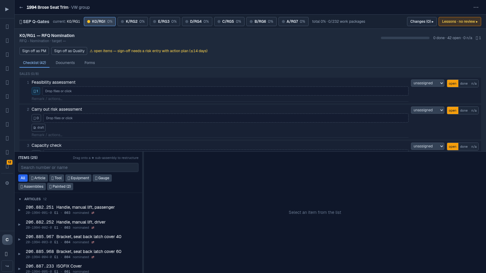

- **Header:** project code, name and customer file naming. The ⋯ menu holds
  Start change request, + Add Part, customer file naming and the timing gates
  (+ Gate).
- **SEP gate bar:** always visible under the header. Click a gate to open its
  review below the bar; click Changes or Lessons to open those instead. Only
  one section is open at a time; click it again or press Escape to close.
- **Items list (left):** grouped into Articles, Tools, Equipment, Gauges and
  Assemblies. Each row shows a thumbnail, the short name, revision
  (**E1** · 003, our E level in bold), phase, and the KTX, Tier 1 and OEM
  numbers. Mirrored parts (LH/RH, 40/60) are joined by a dotted bracket;
  hovering one highlights both.
- **Detail (right):** the selected item with a pinned header and tabs
  (Documents, Links, BOM, Workflow, Changelog; tools get DFM, Tool, Links,
  Changelog). **⧉ Pop out** moves the detail into its own window for a second
  monitor; the list then turns into a table.
- **Keyboard:** Up and Down move through the list, Right and Left expand and
  collapse a row.

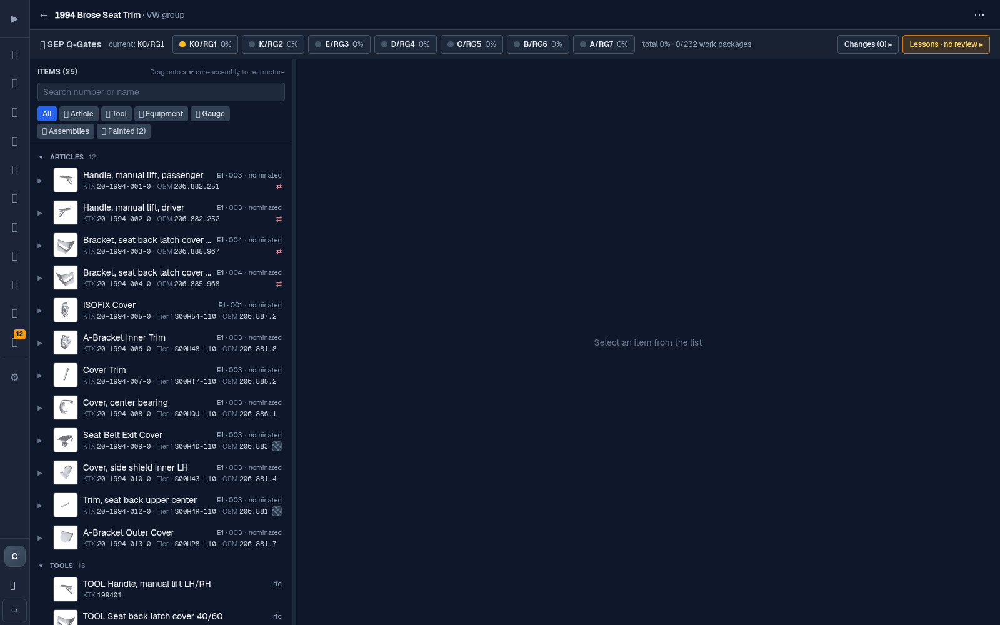

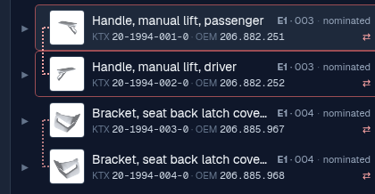

## The Worksheet

Click **Worksheet** in the items header (or open the project with
`?view=worksheet`). The worksheet is a read-only overview built from the
database: one row per article, with the values of the tool that makes it on
the same row. Nothing is typed into the worksheet itself; values are changed
where they live (article, tool, paint), and the worksheet shows the result.

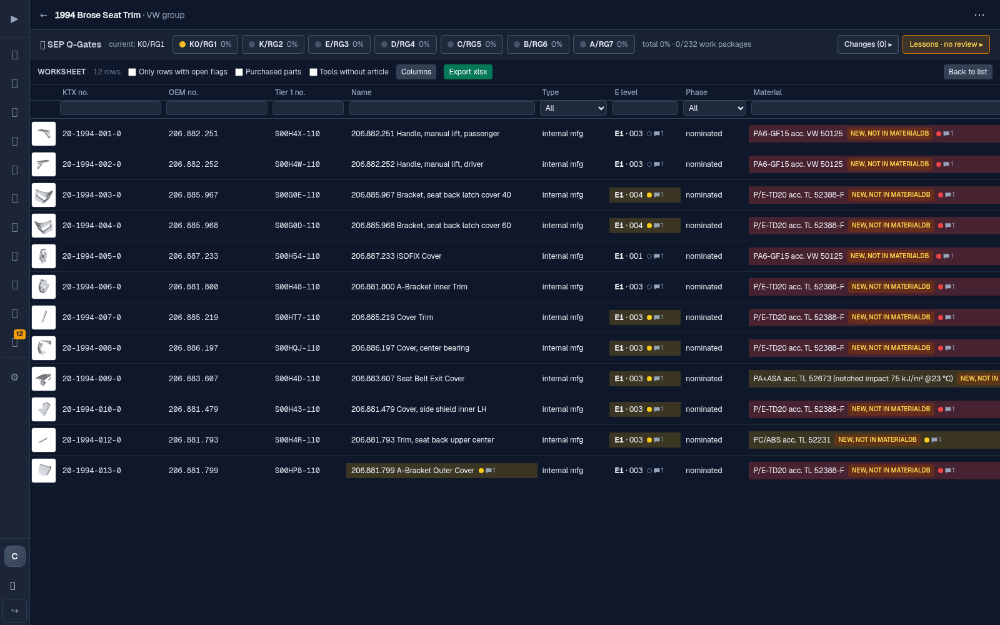

### Columns

| Group | Columns |
|---|---|
| Identity | Image, KTX no., OEM no., Tier 1 no., Name, Type, Mirror of |
| Revision | E level and customer index, Phase |
| Material | Material (linked to MaterialDB or marked new) |
| Appearance | Painted, Colour, Grain |
| Tool | Tool no., Cavities, Toolmaker, Cycle time, Tonnage |
| DFM | DFM status of the tool (waiting on ..., all answered, no topic) |
| Notes | Open flags and the latest comment for the row |

- **Colour:** painted parts show the paint colour with a `paint` tag;
  unpainted parts show the moulded-in colour code (for example NM0) with a
  `MIC` tag.
- **Grain:** the grain from the drawing, for example KF8.
- The image and the KTX and OEM numbers stay in place when you scroll
  sideways.

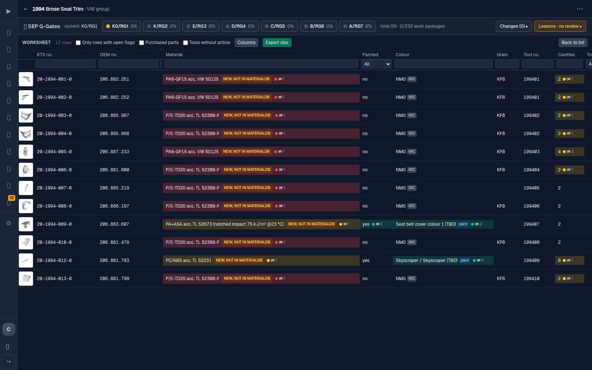

### Filter, sort, columns, export

- Type in the filter field under a column header, or pick a value for list
  columns. Click a header to sort (ascending, descending, off).
- **Columns** shows or hides columns; your choice is remembered in this
  browser.
- **Only rows with open flags** keeps the rows that still need attention.
  **Purchased parts** and **Tools without article** add those rows.
- **Export xlsx** downloads what you see (visible columns and rows) with the
  flag colours: yellow open, green confirmed, red rejected.

### Right-click a cell: Edit, Comment, Flag

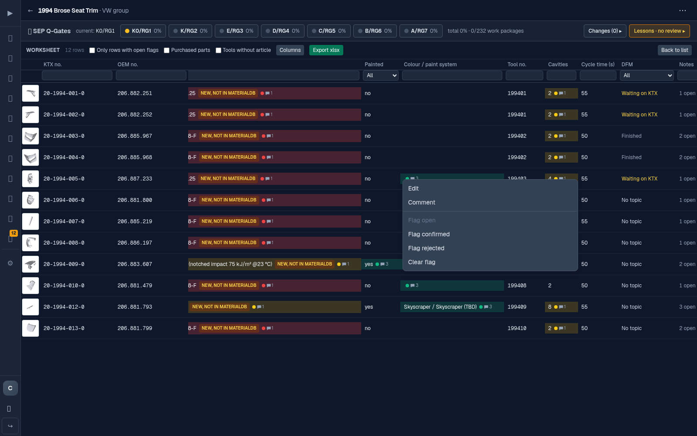

- **Edit** opens the place where the value is changed and highlights the
  field: tool values open the tool page, numbers, material, colour code and
  grain open the article, paint opens the paint section.
- **Comment** opens the comment thread of that field. Comments cannot be
  edited or deleted; a correction is a new comment.
- **Flag** marks the field **open** (yellow), **confirmed** (green) or
  **rejected** (red), or clears the flag.

The same small marker (coloured dot and comment count) appears next to the
field on the article, tool and paint pages, so a flag set in the worksheet is
visible there too. A flag on a tool value (for example cavities) belongs to
the tool, so both articles of a 1+1 tool show it.

The Colour cell holds two fields: the paint colour and the moulded-in colour
code. The menu and the main marker act on the one the cell shows (paint on
painted parts, colour code on the others). A note on the other field shows
as a second, smaller marker in the same cell; click it to read or clear it.
The cell tint and the export take the flag of the two that needs more
attention (open, then rejected, then confirmed), so a cell stays yellow
while either field is still open.

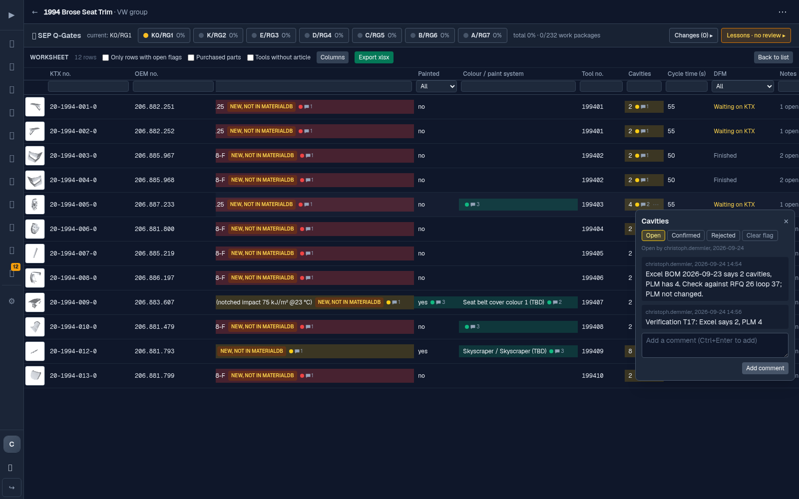

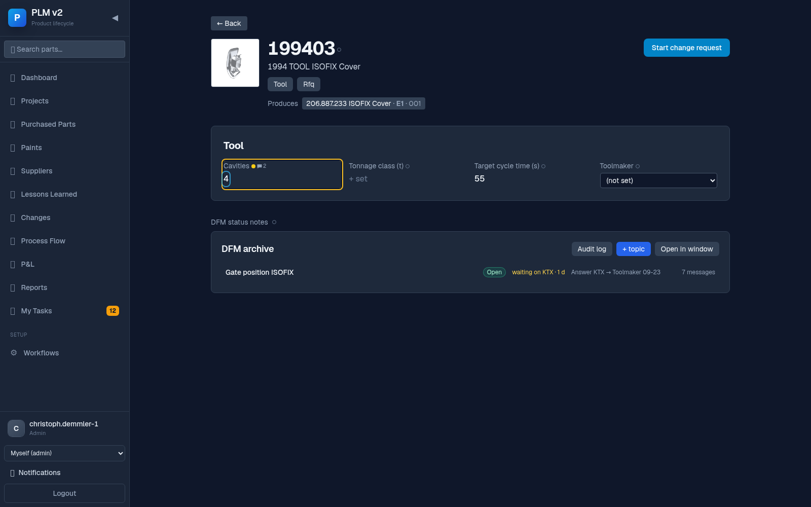

Use comments and flags for everything that is not defined yet during
engineering, for example "resin to be nominated", "grain KF8 on the drawing,
Stipple 4 in the RFQ", or a volume basis question. They are the fastest way
to find and close discrepancies.

### Audit log

Click **Audit log** in the worksheet toolbar. It lists every change on the
project's parts that the worksheet shows, newest first: comments, flags,
material, numbers, colour code, grain, tool values and paint, with time,
user, part, field and old → new value. Filter by group, part and field,
load older entries, and export CSV. Click an entry to open the field where it
is changed. Every comment thread also has a **History** section for that one
field.

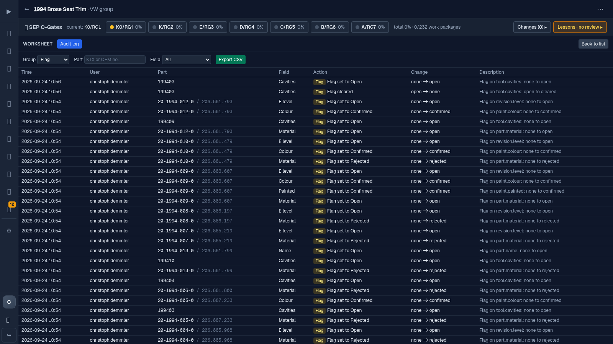

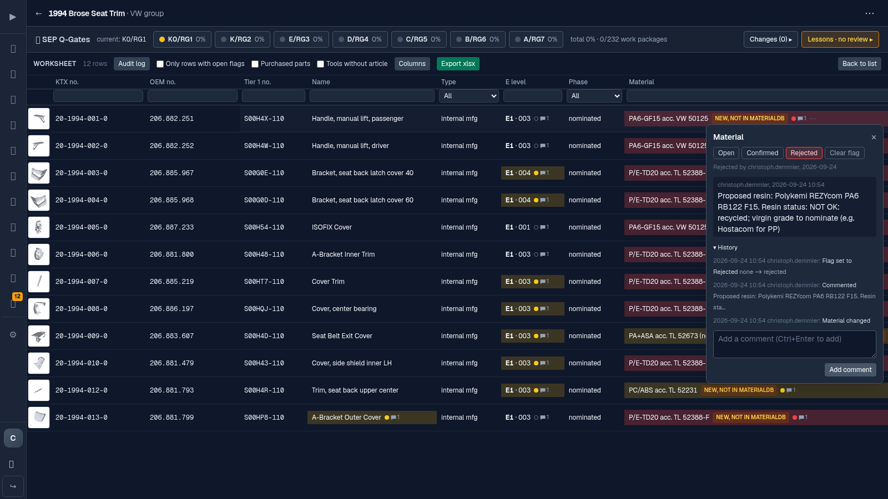

Note: the audit log is complete for changes made in PLM and cannot be edited
from the app. It is not cryptographically sealed against direct database
edits.

## Article fields: material, colour code, grain

On the article page, the **Part Information** card holds:

- **Material:** search **from MaterialDB** (shows the 40- number, trade name
  and grade, with a link to MaterialDB), or choose **New material, not in
  MaterialDB** and type it in. A new material carries an amber
  `NEW, not in MaterialDB` badge until someone creates it in MaterialDB and
  links it. If MaterialDB cannot be reached, the search says so; the saved
  material stays as it is.
- **Colour code:** the moulded-in colour, for example NM0. For painted parts
  the colour comes from the paint section.
- **Grain:** for example KF8 or Stipple 4.

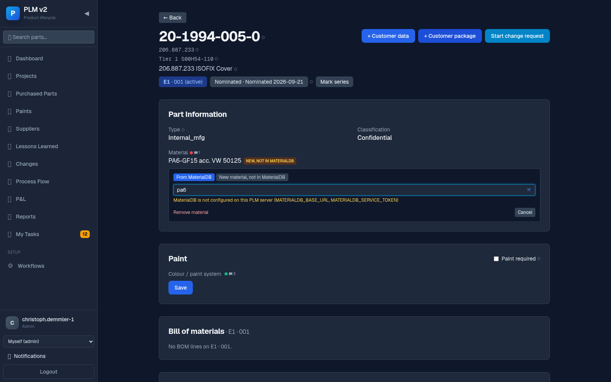

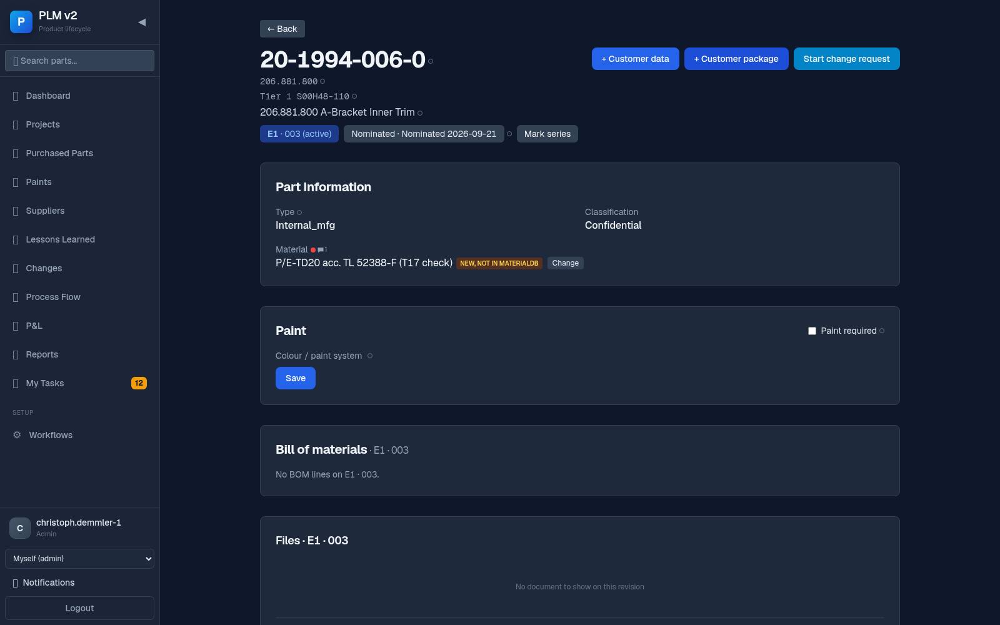

## DFM archive on tools

Open a tool (from the Tools group of the project, or its own page). The DFM
tab holds one topic per question or study; each topic is a flow between
Toolmaker, KTX and Tier 1.

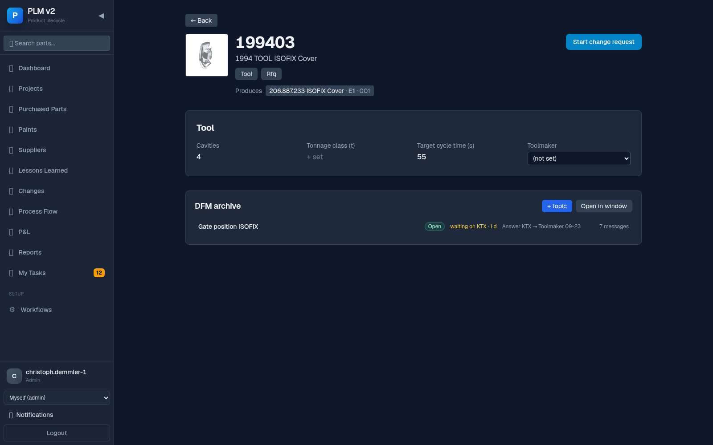

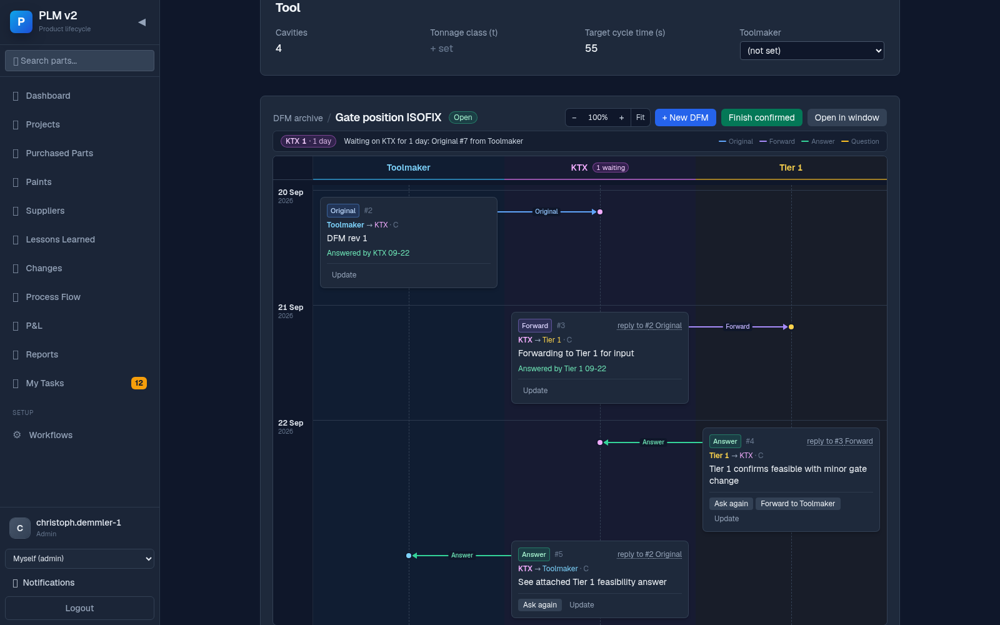

- Every message has a type: **Original** (blue), **Forward** (violet),
  **Answer** (green), **Question** (amber, "ask again"). It sits in the
  sender's lane with an arrow to each receiver; the arrow is dashed while an
  answer is missing.
- Each card says who sent it to whom ("Toolmaker → KTX · 09-20"), which
  message it answers ("reply to #2 Original", click to jump there), and its
  status: "Answered by KTX 09-23" or "Waiting on Tier 1 · 4 days".
- Record the next step from the card: **Answer**, **Ask again**,
  **Forward to Tier 1 / Toolmaker**, or **Update** your own message. The form
  opens filled in and states the step in words. **+ New DFM** starts an
  original. Attach files by drag and drop; PDFs open in the viewer.
- The status line on top says what is pending, for example "Waiting on KTX
  for 1 day: Original #7 from Toolmaker". **Finish confirmed** closes the
  topic; **Reopen** opens it again.
- **Zoom** (−, %, +, Fit, or Ctrl + mouse wheel). Below 75 % the cards turn
  into one-line summaries so a long exchange fits on one screen.
- **Open in window** opens the DFM of the tool in its own window.
- **Audit log** lists every step of the topic (messages, files attached,
  viewed, downloaded, topic finished or reopened) with a checksum for each
  file; export as CSV.

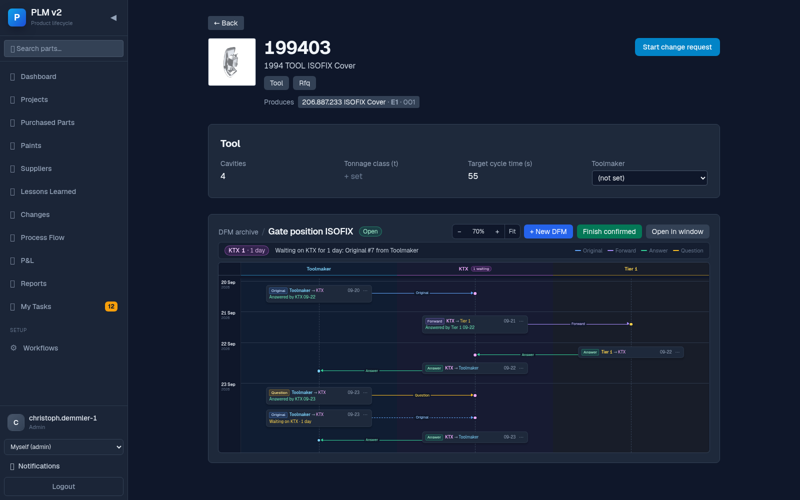

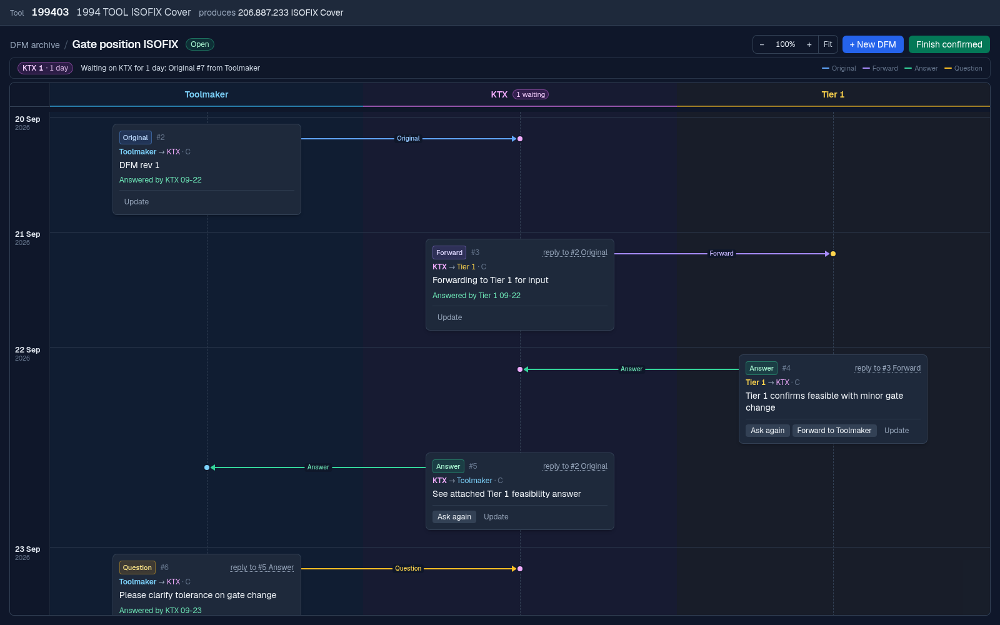

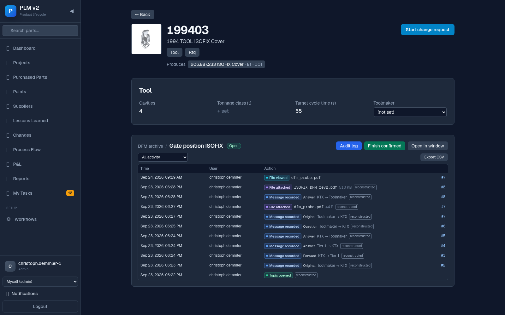

## FAQ

**Where do I change a value I see in the worksheet?** Right-click it and
choose Edit; PLM opens the right page and highlights the field.

**A cell is yellow, who flagged it and why?** Right-click, Comment: the
thread shows the comments and the History section shows who set the flag.

**The Colour cell is empty.** The part is not painted and has no colour code
yet; set the colour code on the article, or the paint on the paint section.

**Why does a material say NEW, not in MaterialDB?** It was typed in because
the material does not exist in MaterialDB yet. Create it in MaterialDB, then
pick it on the article; the badge disappears.
