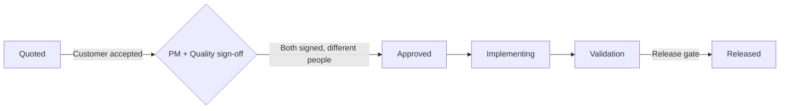
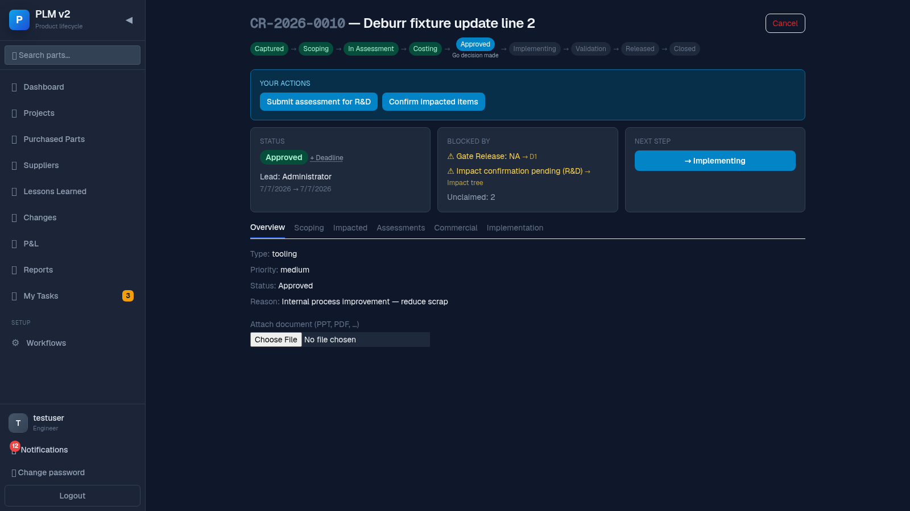

# Quality Guide

This guide is for Quality department members. You share sign-off duty on customer-relevant
changes and have access to the governance views (D1 gates, Audit trail) that most users don't see.

## Your slice of the flow

## Your job in one paragraph

On customer-relevant changes, you provide one of the two required sign-offs before approval — and
it must be a different person from whoever signed as PM (the "4-eyes" rule). You also have access
to the **Governance** tab group (D1 and Audit), where the formal D1 fields and gate decisions
(feasibility / budget / release) live, and where you can review the full audit trail for a change.

## Steps

### 1. Sign off on a customer-relevant change

Open the change's **Commercial** tab once it's in Costing/Quoted and the customer has accepted.
Click **Quality sign-off**. If you already see a ✓ next to it, someone from Quality has already
signed.

**4-eyes rule**: if you were the one who signed as PM sign-off on this change, the Quality
sign-off button will be disabled for you — the two sign-offs must come from different people. A
note ("PM and Quality sign-off must be different users") explains this in place.

### 2. The Governance tabs

If you're a member of the Quality department (or PM, or an admin, or the change's lead), you see
an extra right-aligned **Governance** group in the tab bar with **D1** and **Audit**. Everyday
users (e.g. engineers viewing someone else's change) don't see this group at all.

### 3. D1 tab — gate decisions

Open **D1** to see and set the formal D1 fields (issuer, car line, series flag, CM internal/
external, implementation mode, affected plants, lead part) and to decide the three gates:

- **Feasibility** (`Realisierbar?`) — guards the move into In Assessment.
- **Budget** (`Budget geprüft?`) — guards the move into Costing.
- **Release** (`Techn. Freigabe?`) — guards the move into Implementing.

Each gate is set to `yes`, `no`, or `na`. A gate only actually blocks progress if it guards the
transition the change is trying to make right now — gates for a later stage show up as "later" in
the cockpit's Blocked-by card, not as an active blocker.

### 4. Audit tab — the trail

**Audit** shows the full timeline of everything that happened to this change, scoped by the
change's number. It flags whether the audit chain is intact ("chain intact") or broken ("chain
broken") for this change, and you can export the full history as CSV if you need more than the
newest 1000 entries shown on screen.

### 5. Release gate

Before a change can move from Validation to Released, the **Release** gate needs a decision — this
is one of the checks you're expected to weigh in on alongside the implementation team.

## When things block

- **Quality sign-off button is disabled** — either it's already signed, or you signed as PM on
  this same change (4-eyes rule) — the note under the buttons tells you which.
- **I can't see the D1 or Audit tab on a change** — you're not the lead, not an admin, and not a
  member of Quality or Project Management for this org. Ask an admin to check your department
  membership if you believe you should have access.
- **A link to `?tab=audit` sends me to Overview instead** — that's the same permission check;
  the deep link falls back rather than showing a blank or forbidden page.
- **A gate in "Blocked by" mentions D1 but the D1 tab isn't visible to me** — the reference renders
  as plain text (not a link) for users without governance access; ask someone with Governance
  access (lead, PM, Quality, admin) to decide the gate.
