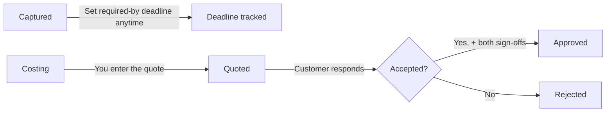
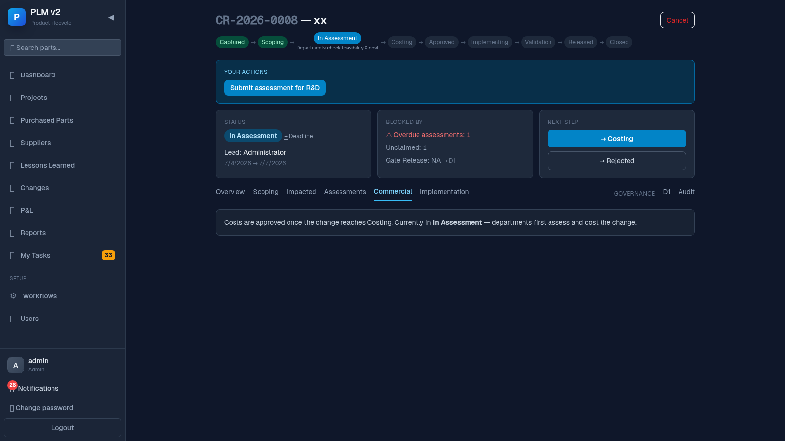
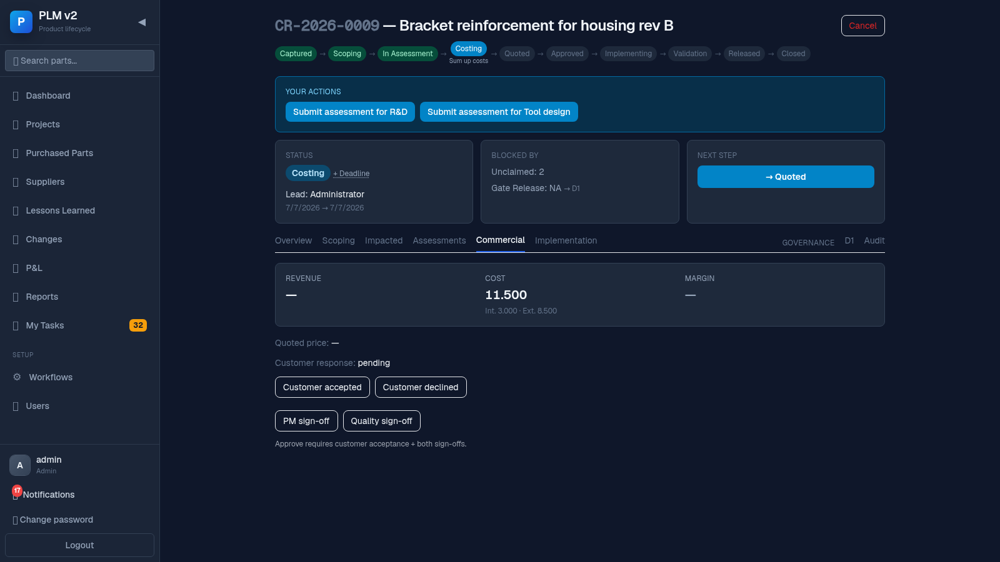
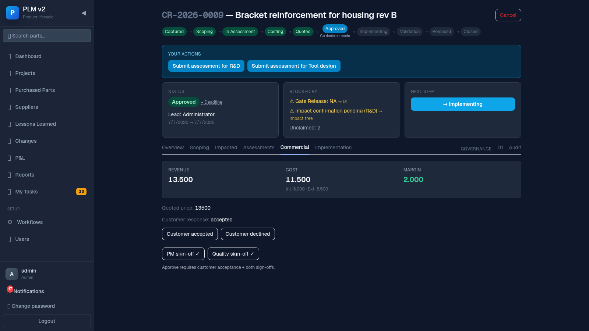
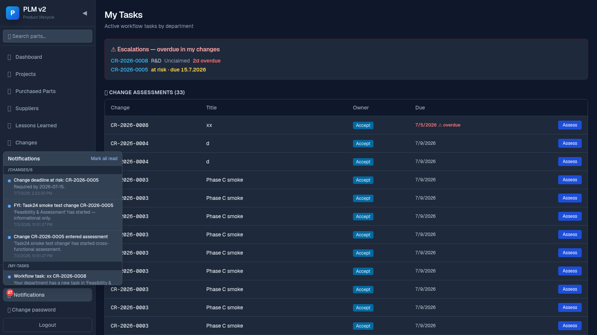

# Sales Guide

This guide is for Sales / commercial staff working customer-relevant changes — the ones where a
customer has to accept a price before the change is approved.

## Your slice of the flow

## Your job in one paragraph

For customer-relevant changes, you set (and can revise) the deadline the customer needs an answer
by, enter the quoted price once costing is done, and record whether the customer accepted or
declined. The change can't be approved without your quote and the customer's acceptance.

## Steps

### 1. Set or check the required-by deadline

In the cockpit's **Status** card, click the deadline chip's ✎ (or "+ Deadline" if none is set
yet) to open the deadline editor. Set the date and, if useful, a reason. The chip then shows how
many days are left (e.g. "3d") or overdue (e.g. "2d over").

- **On-track** — deadline chip in blue, plenty of time.
- **At-risk** — chip in amber, deadline is close.
- **Overdue** — chip in red, deadline has passed.

### 2. Wait for costing, then enter the quote

Once the change reaches **Costing** (or **Quoted**), open the **Commercial** tab. Before that
point the tab just explains that quotes are entered once costing is reached — there's nothing to
enter yet.

Once costing is reached, an inline **Quoted price** editor appears — type the amount and click
**Save**.

### 3. Record the customer's response

Once a price is entered, two buttons appear: **Customer accepted** and **Customer declined**.
Click the one that matches what the customer told you.

### 4. Sign-offs (PM + Quality)

Approval also needs a PM sign-off and a Quality sign-off from two different people — you'll see
these as separate buttons in the same tab; if you also hold one of those roles you may be asked to
sign, but the same person can't sign both.

### 5. Check the P&L card

The Commercial tab shows a compact P&L card: Revenue (your quoted price), Cost (internal +
external), and Margin — useful for a sanity check before the customer sees the number.

### 6. Notifications

The bell icon shows unread notifications; if a deadline you're tracking goes from at-risk to
overdue, you'll see it there and in **My Tasks**.

## When things block

- **I don't see a field to enter the quote** — the change hasn't reached Costing yet; the tab
  explains this and names the current status. Check with the assessing departments or Project
  Management.
- **"Approve requires customer acceptance + both sign-offs"** — one of the three is still
  missing: customer response, PM sign-off, or Quality sign-off. Check which is missing in the
  Commercial tab.
- **My quoted-price field is read-only** — it's only editable while the change is in Costing or
  Quoted; once approved it's locked to preserve the record.
- **A deadline shows overdue and I can't seem to fix it** — the deadline itself doesn't block
  anything by force, but it will keep escalating (bell + My Tasks) to you and the change's lead
  until the change moves forward or you update the date.
