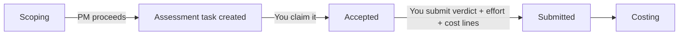
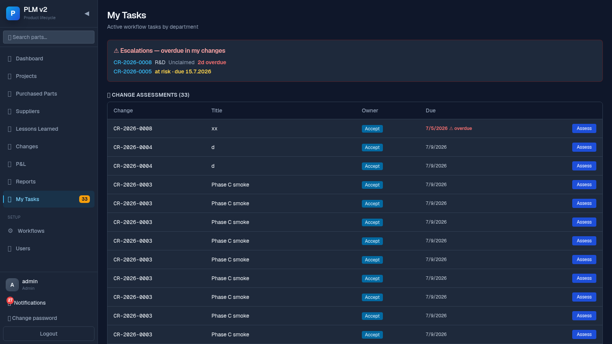
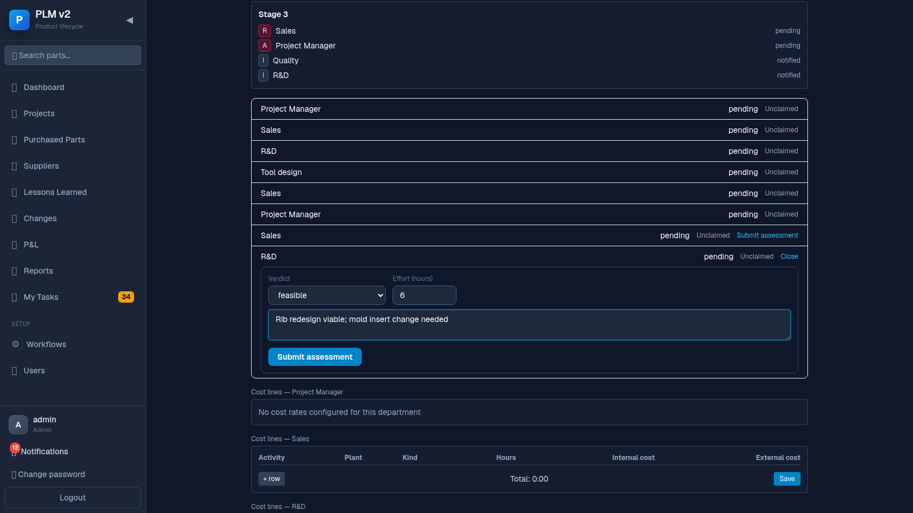

# Technical Departments Guide (Assessors)

This guide is for anyone in a department that gets asked to assess a change — R&D, Tool
Engineering, and similar. Your job is to say whether the change is feasible and what it will cost
your department.

## Your slice of the flow

## Your job in one paragraph

When Project Management proceeds a change past scoping, your department may get an assessment
task. You claim it, decide whether the change is feasible for your area, log the hours you spent
figuring that out, and add cost lines (hours × your department's rate, plus any external cost) so
the change's total cost can be summed up.

## Steps

### 1. Find your tasks

Go to **My Tasks** in the sidebar.

What you see:

- An **Escalations** card at the top if anything overdue affects a change you lead (usually not
  relevant to you as an assessor, but shown here too if applicable).
- A **Change Assessments** table listing assessment tasks — yours are marked with a blue left
  border; unclaimed ones show an **Accept** button in the owner column.
- Below the department selector, a full task table (Part / Revision / Step / Stage / Owner / Due /
  RASIC / Started) if you also have other workflow tasks.

### 2. Claim (accept) the task

Click **Accept** next to an unclaimed task. Once accepted, your name appears in the owner column
and you're the one responsible for submitting the assessment.

### 3. Submit your assessment

Open the change (click **Assess**, or navigate to it) and go to the **Assessments** tab. Find your
department's row and click **Submit assessment** to open the form.

What you fill in:

- **Verdict** — `feasible`, `feasible_with_conditions`, or `not_feasible`.
- **Effort (hours)** — how many hours you (your department) spent assessing this. Required, must
  be ≥ 0.
- **Conditions** — only shown if you picked "feasible with conditions"; describe what needs to be
  true.
- **Notes** — free text.

The **Submit assessment** button only becomes active once you've picked a verdict and entered
effort hours.

### 4. Add cost lines

Below the assessment list, each department gets a **Cost lines** grid (one-time or lifecycle,
internal or external cost, hours × your department's rate for internal cost, plus a manual
external-cost field where relevant). This is what feeds the change's cost summation that Project
Management checks before approving.

### 5. What "overdue" means for you

If your task has a due date that's passed without a submitted assessment, it shows a red "⚠
overdue" marker in both My Tasks and the Assessments tab — and Project Management (the change's
lead) is notified too, not just you. Claim and submit as soon as you can once you see this.

## When things block

- **I don't see my department's task at all, even though it was selected in scoping** —
  assessment tasks come from the routing template's rules for which departments are *blocking*
  for this change, not directly from the scoping selection. The Assessments tab has a line ("From
  scoping: ...") explaining which selected departments got a task and which didn't. If yours
  should have one and doesn't, ask Project Management or an admin to check the routing template.
- **The Submit assessment button won't enable** — you need both a verdict and an effort-hours
  value before it activates.
- **I can't add a cost line / no rate shows** — if you see "No cost rates configured for this
  department", ask an admin to configure a rate for your department; internal cost can't be
  computed from hours without one. You can still add external cost lines.
