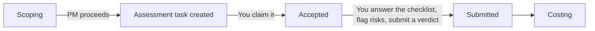
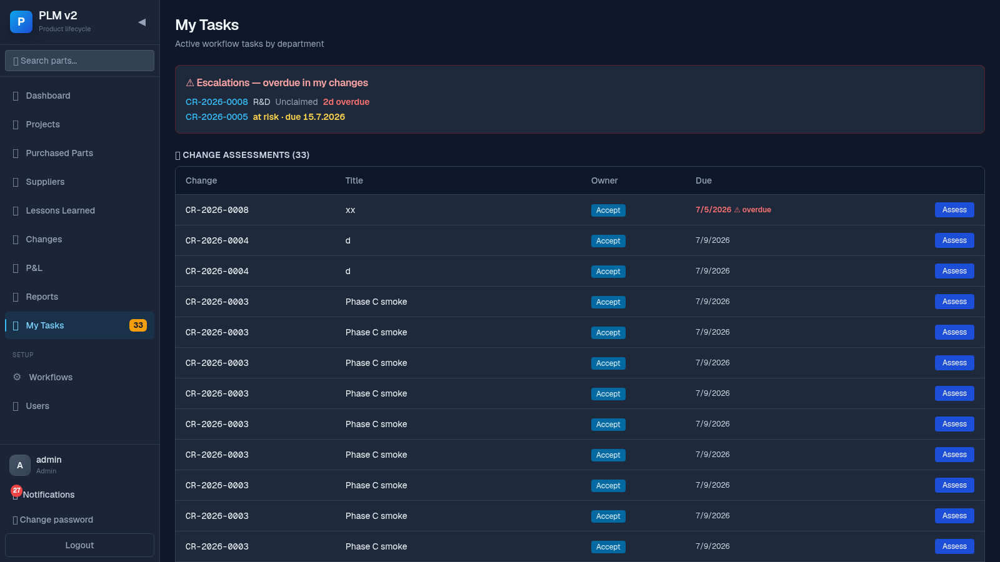
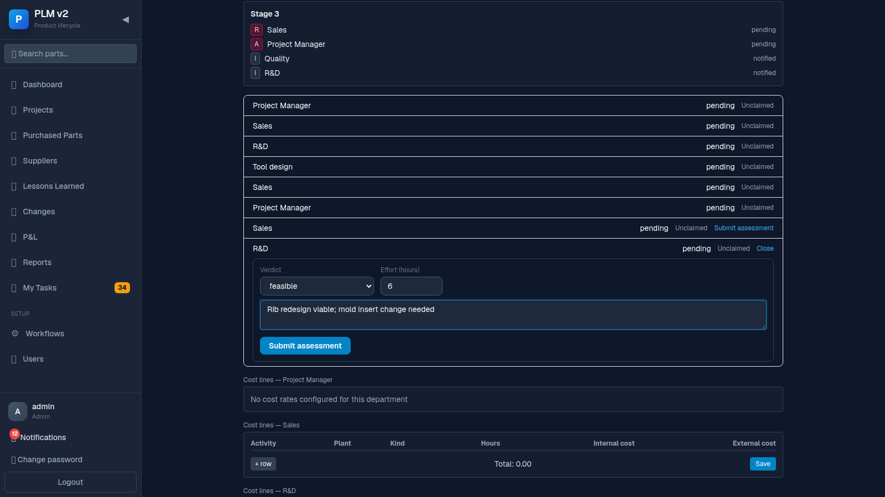

# Technical Departments Guide (Assessors)

This guide is for anyone in a department that gets asked to assess a change — R&D, Tool
Engineering, and similar. Your job is to say whether the change is feasible and what it will cost
your department.

## Your slice of the flow

```mermaid
flowchart LR
    Scoping -->|PM proceeds| Task[Assessment task created]
    Task -->|You claim it| Claimed[Accepted]
    Claimed -->|You answer the checklist, flag risks, submit a verdict| Submitted
    Submitted --> Costing
```

## Your job in one paragraph

When Project Management proceeds a change past scoping, your department may get an assessment
task. You claim it, decide whether the change is feasible for your area, log the hours you spent
figuring that out, and add cost lines (hours × your department's rate, plus any external cost) so
the change's total cost can be summed up.

## Steps

### 1. Find your tasks

Go to **My Tasks** in the sidebar.

What you see:

- An **Escalations** card at the top if anything overdue affects a change you lead (usually not
  relevant to you as an assessor, but shown here too if applicable).
- A **Change Assessments** table listing assessment tasks — yours are marked with a blue left
  border; unclaimed ones show an **Accept** button in the owner column.
- Below the department selector, a full task table (Part / Revision / Step / Stage / Owner / Due /
  RASIC / Started) if you also have other workflow tasks.

### 2. Claim (accept) the task

Click **Accept** next to an unclaimed task. Once accepted, your name appears in the owner column
and you're the one responsible for submitting the assessment.

### 3. Answer the impacted-areas checklist

Open the change (click **Assess**, or navigate to it) and go to the **Assessments** tab. Your
department's section opens with the objects you assess, the **Risks** panel, and the
**Impacted areas** checklist.

Every row asks one question ("Cycle time change", "3D change necessary", …) and must be answered
**No** or **Yes**. Nothing is pre-selected: an unanswered row and a considered "No" must not look
the same.

- **Yes** means the area is impacted. It asks what has to be done (remark), a sub-choice where the
  row has one, and for *External modification* the supplier RFQ. Yes rows are pre-seeded into your
  cost input at costing.
- **No** means you looked and it is not impacted.
- **Rest → No** (next to the "n of 13 answered" counter) sets every row you have *not* answered yet
  to No. Rows you already answered stay as they are, and every row stays changeable. Reviewers see
  how many No answers came from it ("12 × No (9 set via Rest → No)"), so use it for the rows you
  really checked, not to skip the list.
- **+ Own item** adds a line the list does not cover; it counts as Yes.

The counter above the list shows how far you are. **Submit** stays disabled until every row is
answered; the "n rows unanswered" link next to it jumps to the first open row and marks the others.

### 4. Flag risks on the row

If a row makes you worried, whether you answered Yes *or* No ("no 3D change, but the tolerance
stack is tight"), click **⚑ Flag risk** on that row. The risk form opens under the row with the
row name and your remark already in the note; you pick the risk type and a severity (1 low – 3
high) and click **⚑ Flag risk**. A row can carry more than one risk.

The row then lists its open risks compactly ("⚑ 2 · Fill issue · gate moves 2 mm"). Click one to
jump to its card in the **Risks** panel above. That card is the one place for everything you do
with a risk afterwards:

- **+ Mitigation proposal**: how you propose to handle it (with its document).
- **Risk resolved**: close it, saying how it was addressed.
- **Delete (added by mistake)**: only for the person who raised it, only while it is still open
  and nothing (no proposal, no document) hangs off it. The risk disappears from the list and the
  counts; the change history keeps a "risk deleted, raised by mistake" entry.

Cards raised from a row say where they came from ("from: 3D change necessary"). For a risk that
fits no row, use **+ Risk not on the checklist** in the panel.

Risks never block your submit: you submit your verdict *with* your open risks. Severity-3 risks
are carried onto the offer by Sales.

### 5. Submit your verdict

- **Verdict** — `feasible`, `feasible_with_conditions`, or `not_feasible`.
- **Conditions** — only shown if you picked "feasible with conditions"; describe what needs to be
  true.
- **Notes** — free text.
- A `not_feasible` verdict needs the **Change PPT** (the explanation the customer is shown) in your
  department's section before it can be sent.

After submitting, your section shows the answer: the Yes rows by name (⚑ where a row still has an
open risk) and the No answers collapsed as "n × No".

### 6. Add cost lines

Below the assessment list, each department gets a **Cost lines** grid (one-time or lifecycle,
internal or external cost, hours × your department's rate for internal cost, plus a manual
external-cost field where relevant). This is what feeds the change's cost summation that Project
Management checks before approving.

### 7. What "overdue" means for you

If your task has a due date that's passed without a submitted assessment, it shows a red "⚠
overdue" marker in both My Tasks and the Assessments tab — and Project Management (the change's
lead) is notified too, not just you. Claim and submit as soon as you can once you see this.

## When things block

- **I don't see my department's task at all, even though it was selected in scoping** —
  assessment tasks come from the routing template's rules for which departments are *blocking*
  for this change, not directly from the scoping selection. The Assessments tab has a line ("From
  scoping: ...") explaining which selected departments got a task and which didn't. If yours
  should have one and doesn't, ask Project Management or an admin to check the routing template.
- **The Submit button won't enable**: every checklist row needs a No or Yes (follow the
  "n rows unanswered" link), and you need a verdict. If the checklist did not load, reload the
  page; the form will not submit an empty checklist.
- **I flagged a risk by accident**: on its card in the Risks panel, **Delete (added by mistake)**.
  If someone already added a proposal or a document to it, close it with **Risk resolved** instead.
- **I can't add a cost line / no rate shows** — if you see "No cost rates configured for this
  department", ask an admin to configure a rate for your department; internal cost can't be
  computed from hours without one. You can still add external cost lines.
